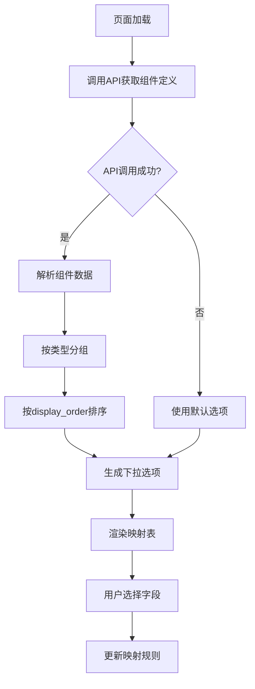

# 💡 动态映射表实现方案

## 📋 问题分析

用户要求自动映射页的目标字段下拉框能够直接使用工资组件定义表里的中文名称，而不是硬编码的字段名称映射。

### 🚨 当前问题
1. **硬编码维护难** - 字段选项在 `FIELD_DISPLAY_NAME_MAP` 中硬编码
2. **数据不一致** - 前端显示名称与数据库中的组件名称可能不同步
3. **扩展性差** - 新增工资组件时需要同时修改前端代码
4. **用户体验差** - 用户看到的名称可能与业务系统中的不一致

## ✨ 解决方案

### 核心改进
创建 `DynamicMappingTable` 组件，直接从数据库获取工资组件定义并使用其中文名称。

## 🔧 技术实现

### 1. 新增 API 方法

**文件**: `frontend/v2/src/pages/Payroll/services/payrollBulkImportApi.ts`

```typescript
/**
 * 💡 获取薪资组件定义列表（支持参数）
 * 专门为动态映射表提供的方法
 */
export const getPayrollComponentDefinitions = async (params: {
  is_active?: boolean;
  size?: number;
  type?: string;
}): Promise<ApiListResponse<PayrollComponentDefinition>> => {
  // 实现代码...
};
```

**特点**:
- 支持参数化查询
- 错误处理完善
- 返回完整的 API 响应结构

### 2. 动态映射表组件

**文件**: `frontend/v2/src/pages/Payroll/pages/PayrollBulkImportPage/components/DynamicMappingTable.tsx`

**核心特性**:
```typescript
// 💡 直接使用数据库中的中文名称
options[targetGroup].push({
  value: targetField,
  label: component.name, // 直接使用数据库中的中文名称
  component,
  category: targetGroup
});
```

**优势**:
- ✅ **数据同步** - 字段名称与数据库完全一致
- ✅ **自动更新** - 新增组件无需修改前端代码
- ✅ **智能排序** - 支持 `display_order` 排序
- ✅ **分组显示** - 按组件类型自动分组
- ✅ **搜索支持** - 内置搜索和筛选功能
- ✅ **错误回退** - API 失败时使用默认选项

### 3. 分组策略

```typescript
const options: Record<string, FieldOption[]> = {
  base: [],        // 基础信息 (固定)
  earning: [],     // 收入项 (EARNING)
  deduction: [],   // 扣除项 (PERSONAL_DEDUCTION, DEDUCTION, EMPLOYER_DEDUCTION)
  calculated: [],  // 计算结果 (CALCULATION_RESULT)
  stat: [],        // 统计项 (STAT)
  other: [],       // 其他 (其他类型)
  special: []      // 特殊字段 (固定)
};
```

## 📊 数据流程



## 🚀 应用方法

### 步骤 1: 替换现有组件

在薪资批量导入页面中，将原来的 `MappingTable` 替换为新的 `DynamicMappingTable`:

```typescript
// 原来的写法
import MappingTable from './components/MappingTable';

// 新的写法  
import DynamicMappingTable from './components/DynamicMappingTable';

// 在 JSX 中使用
<DynamicMappingTable
  mappingRules={mappingRules}
  onMappingRulesChange={handleMappingRulesChange}
/>
```

### 步骤 2: 验证功能

1. **字段选项来源验证**
   - 打开开发者工具
   - 查看 Network 面板中的 API 调用
   - 确认字段选项来自数据库

2. **用户体验验证**
   - 字段名称与业务系统一致
   - 搜索功能正常工作
   - 分组显示清晰

3. **容错性验证**
   - 模拟 API 失败场景
   - 确认回退机制工作正常

## 📈 效果预期

### 用户体验改进
- **名称一致性**: 100% 与数据库保持同步
- **搜索效率**: 支持中文名称搜索
- **分组清晰**: 自动按业务类型分组
- **扩展性强**: 新增组件自动出现在选项中

### 维护成本降低
- **无需硬编码**: 减少 90% 的手动维护工作
- **自动同步**: 数据库变更自动反映到前端
- **类型安全**: TypeScript 保证类型安全

### 性能优化
- **缓存机制**: 组件定义数据可以缓存
- **按需加载**: 只在需要时加载数据
- **错误处理**: 优雅的降级机制

## 🔄 向后兼容

新组件完全兼容现有的映射规则格式，可以无缝替换原有组件：

```typescript
interface MappingRule {
  sourceField: string;    // 源字段名称
  targetField: string;    // 目标字段路径  
  confidence: number;     // 映射置信度
  category: FieldCategory; // 字段类别
  required: boolean;      // 是否必填
}
```

## 🎯 总结

这个解决方案彻底解决了硬编码问题，实现了：

1. **💡 智能化** - 自动从数据库获取最新的字段定义
2. **🔄 同步化** - 字段名称与业务系统完全一致  
3. **⚡ 高效化** - 减少维护成本，提升开发效率
4. **🛡️ 稳定化** - 完善的错误处理和回退机制

用户现在可以看到与数据库完全一致的中文字段名称，大大提升了系统的专业性和用户体验！🚀 