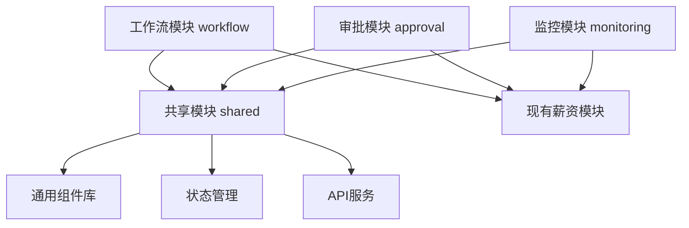

# 工资审批流程前端设计方案

## 📋 目录

1. [设计概述](#设计概述)
2. [模块架构](#模块架构)
3. [核心组件设计](#核心组件设计)
4. [页面设计](#页面设计)
5. [状态管理](#状态管理)
6. [权限控制](#权限控制)
7. [用户体验设计](#用户体验设计)
8. [技术实现](#技术实现)

---

## 🎯 设计概述

### 📝 设计目标
基于工资审批流程规范，设计一套完整的前端工作流系统，实现：
- 🔄 可视化流程管理
- ✅ 高效审批操作
- 📊 实时状态监控
- 🔐 精细权限控制
- 📱 响应式用户界面

### 🏗️ 设计原则
- **用户中心**：以用户角色和使用场景为核心
- **流程驱动**：界面设计紧密贴合业务流程
- **状态可视**：清晰展示流程状态和进度
- **操作简化**：减少用户操作步骤和认知负担
- **响应及时**：实时反馈和状态更新

### 🎨 设计风格
- **现代简约**：采用Ant Design设计语言
- **信息层次**：合理的信息架构和视觉层次
- **交互友好**：直观的交互反馈和引导
- **移动适配**：支持移动端操作

---

## 🏗️ 模块架构

### 📁 目录结构
```
frontend/v2/src/pages/Payroll/
├── workflow/                          // 🔄 工作流核心模块
│   ├── components/                    // 工作流组件
│   │   ├── WorkflowStatusCard.tsx     // 流程状态卡片
│   │   ├── WorkflowTimeline.tsx       // 流程时间线
│   │   ├── ApprovalPanel.tsx          // 审批面板
│   │   ├── WorkflowActions.tsx        // 流程操作按钮
│   │   ├── StatusIndicator.tsx        // 状态指示器
│   │   ├── ProcessProgress.tsx        // 流程进度条
│   │   └── WorkflowNotification.tsx   // 流程通知
│   ├── pages/                         // 工作流页面
│   │   ├── WorkflowDashboard.tsx      // 工作流仪表板
│   │   ├── ApprovalCenter.tsx         // 审批中心
│   │   ├── WorkflowHistory.tsx        // 流程历史
│   │   ├── WorkflowSettings.tsx       // 流程设置
│   │   └── WorkflowDetail.tsx         // 流程详情
│   ├── hooks/                         // 工作流钩子
│   │   ├── useWorkflowStatus.ts       // 流程状态管理
│   │   ├── useApprovalActions.ts      // 审批操作
│   │   ├── useWorkflowPermissions.ts  // 流程权限
│   │   ├── useWorkflowNotification.ts // 流程通知
│   │   └── useWorkflowTimer.ts        // 流程计时器
│   ├── services/                      // 工作流服务
│   │   ├── workflowApi.ts             // 工作流API
│   │   ├── approvalApi.ts             // 审批API
│   │   └── notificationApi.ts         // 通知API
│   └── types/                         // 工作流类型
│       ├── workflowTypes.ts           // 工作流类型定义
│       ├── approvalTypes.ts           // 审批类型定义
│       └── notificationTypes.ts       // 通知类型定义

├── approval/                          // ✅ 审批专用模块
│   ├── components/
│   │   ├── ApprovalForm.tsx           // 审批表单
│   │   ├── ApprovalHistory.tsx        // 审批历史
│   │   ├── ApprovalComments.tsx       // 审批意见
│   │   ├── BatchApproval.tsx          // 批量审批
│   │   ├── ApprovalSignature.tsx      // 审批签名
│   │   └── ApprovalAttachment.tsx     // 审批附件
│   ├── pages/
│   │   ├── PendingApprovals.tsx       // 待审批列表
│   │   ├── ApprovalDetail.tsx         // 审批详情
│   │   ├── ApprovalReport.tsx         // 审批报告
│   │   └── MyApprovals.tsx            // 我的审批
│   └── hooks/
│       ├── useApprovalList.ts         // 审批列表管理
│       ├── useApprovalForm.ts         // 审批表单管理
│       └── useBatchApproval.ts        // 批量审批管理

├── monitoring/                        // 📊 监控分析模块
│   ├── components/
│   │   ├── ProcessMonitor.tsx         // 流程监控
│   │   ├── AlertPanel.tsx             // 预警面板
│   │   ├── MetricsChart.tsx           // 指标图表
│   │   ├── PerformanceCard.tsx        // 性能卡片
│   │   └── TrendAnalysis.tsx          // 趋势分析
│   ├── pages/
│   │   ├── MonitoringDashboard.tsx    // 监控仪表板
│   │   ├── AlertCenter.tsx            // 预警中心
│   │   ├── PerformanceReport.tsx      // 性能报告
│   │   └── AuditTrail.tsx             // 审计跟踪
│   └── hooks/
│       ├── useMonitoringData.ts       // 监控数据管理
│       ├── useAlertSystem.ts          // 预警系统管理
│       └── usePerformanceMetrics.ts   // 性能指标管理

└── shared/                            // 🔧 共享模块
    ├── components/
    │   ├── RoleBasedAccess.tsx        // 基于角色的访问控制
    │   ├── TimelineView.tsx           // 时间线视图
    │   ├── StatusBadge.tsx            // 状态徽章
    │   └── ActionButton.tsx           // 操作按钮
    ├── utils/
    │   ├── workflowUtils.ts           // 工作流工具函数
    │   ├── permissionUtils.ts         // 权限工具函数
    │   └── dateUtils.ts               // 日期工具函数
    └── constants/
        ├── workflowConstants.ts       // 工作流常量
        ├── statusConstants.ts         // 状态常量
        └── permissionConstants.ts     // 权限常量
```

### 🔄 模块关系图


--- 

## 🎨 核心组件设计

### 🔄 WorkflowStatusCard - 流程状态卡片
```typescript
interface WorkflowStatusCardProps {
  workflowId: string;
  currentStep: number;
  totalSteps: number;
  status: WorkflowStatus;
  estimatedCompletion?: Date;
  urgency?: 'low' | 'normal' | 'high' | 'urgent';
  onViewDetails?: () => void;
}

// 功能特性：
// - 显示当前流程进度
// - 状态颜色编码
// - 预计完成时间
// - 紧急程度标识
// - 快速操作入口
```

### 📊 WorkflowTimeline - 流程时间线
```typescript
interface WorkflowTimelineProps {
  steps: WorkflowStep[];
  currentStepIndex: number;
  showEstimatedTime?: boolean;
  interactive?: boolean;
  onStepClick?: (stepIndex: number) => void;
}

interface WorkflowStep {
  id: string;
  title: string;
  description?: string;
  status: 'pending' | 'in_progress' | 'completed' | 'rejected' | 'skipped';
  assignee?: User;
  startTime?: Date;
  endTime?: Date;
  estimatedDuration?: number; // 分钟
  comments?: string;
}

// 功能特性：
// - 垂直时间线布局
// - 步骤状态可视化
// - 执行人信息显示
// - 时间信息展示
// - 交互式步骤点击
```

### ✅ ApprovalPanel - 审批面板
```typescript
interface ApprovalPanelProps {
  workflowId: string;
  currentStep: WorkflowStep;
  permissions: ApprovalPermissions;
  onApprove: (comment: string, attachments?: File[]) => Promise<void>;
  onReject: (reason: string, attachments?: File[]) => Promise<void>;
  onDelegate: (targetUser: User, comment: string) => Promise<void>;
  onReturn: (targetStep: number, reason: string) => Promise<void>;
}

// 功能特性：
// - 审批操作按钮组
// - 审批意见输入
// - 附件上传支持
// - 委托审批功能
// - 退回指定步骤
// - 批量审批支持
```

### 🎯 WorkflowActions - 流程操作按钮
```typescript
interface WorkflowActionsProps {
  workflowId: string;
  currentStatus: WorkflowStatus;
  userRole: UserRole;
  permissions: WorkflowPermissions;
  actions: WorkflowAction[];
  onAction: (action: WorkflowAction) => Promise<void>;
}

interface WorkflowAction {
  key: string;
  label: string;
  icon?: React.ReactNode;
  type: 'primary' | 'default' | 'danger';
  disabled?: boolean;
  loading?: boolean;
  confirmRequired?: boolean;
  confirmMessage?: string;
}

// 功能特性：
// - 动态操作按钮
// - 权限控制显示
// - 确认对话框
// - 加载状态反馈
// - 批量操作支持
```

### 📈 ProcessProgress - 流程进度条
```typescript
interface ProcessProgressProps {
  currentStep: number;
  totalSteps: number;
  stepNames?: string[];
  showPercentage?: boolean;
  showStepInfo?: boolean;
  size?: 'small' | 'default' | 'large';
  status?: 'normal' | 'exception' | 'success';
}

// 功能特性：
// - 步骤进度可视化
// - 百分比显示
// - 步骤名称标注
// - 异常状态提示
// - 多种尺寸支持
```

### 🔔 WorkflowNotification - 流程通知
```typescript
interface WorkflowNotificationProps {
  notifications: WorkflowNotification[];
  onMarkAsRead: (notificationId: string) => void;
  onMarkAllAsRead: () => void;
  onNotificationClick: (notification: WorkflowNotification) => void;
}

interface WorkflowNotification {
  id: string;
  type: 'approval_required' | 'approved' | 'rejected' | 'overdue' | 'completed';
  title: string;
  message: string;
  workflowId: string;
  timestamp: Date;
  isRead: boolean;
  urgency: 'low' | 'normal' | 'high';
  actionRequired?: boolean;
}

// 功能特性：
// - 实时通知显示
// - 通知类型分类
// - 已读/未读状态
// - 紧急程度标识
// - 快速操作入口
```

---

## 🗄️ 状态管理

### 🔄 工作流状态管理
```typescript
// 使用 Zustand 进行状态管理
interface WorkflowStore {
  // 状态数据
  workflows: WorkflowInstance[];
  currentWorkflow: WorkflowInstance | null;
  pendingApprovals: ApprovalTask[];
  notifications: WorkflowNotification[];
  
  // 加载状态
  loading: {
    workflows: boolean;
    approvals: boolean;
    notifications: boolean;
  };
  
  // 操作方法
  fetchWorkflows: () => Promise<void>;
  fetchPendingApprovals: () => Promise<void>;
  approveWorkflow: (workflowId: string, comment: string) => Promise<void>;
  rejectWorkflow: (workflowId: string, reason: string) => Promise<void>;
  updateWorkflowStatus: (workflowId: string, status: WorkflowStatus) => void;
  
  // 通知管理
  addNotification: (notification: WorkflowNotification) => void;
  markNotificationAsRead: (notificationId: string) => void;
  clearNotifications: () => void;
}
```

### 📊 实时数据同步
```typescript
// WebSocket 连接管理
interface WorkflowWebSocketManager {
  connect: () => void;
  disconnect: () => void;
  subscribe: (workflowId: string) => void;
  unsubscribe: (workflowId: string) => void;
  
  // 事件处理
  onWorkflowStatusChange: (callback: (data: WorkflowStatusUpdate) => void) => void;
  onNewApprovalTask: (callback: (task: ApprovalTask) => void) => void;
  onNotificationReceived: (callback: (notification: WorkflowNotification) => void) => void;
}
```

---

## 🔐 权限控制

### 👥 基于角色的访问控制
```typescript
// 权限组件
interface RoleBasedAccessProps {
  requiredRoles: UserRole[];
  requiredPermissions?: string[];
  fallback?: React.ReactNode;
  children: React.ReactNode;
}

// 权限钩子
const useWorkflowPermissions = (workflowId: string) => {
  const { user } = useAuth();
  
  return {
    canView: checkPermission(user, 'workflow:view', workflowId),
    canApprove: checkPermission(user, 'workflow:approve', workflowId),
    canReject: checkPermission(user, 'workflow:reject', workflowId),
    canDelegate: checkPermission(user, 'workflow:delegate', workflowId),
    canEdit: checkPermission(user, 'workflow:edit', workflowId),
    canDelete: checkPermission(user, 'workflow:delete', workflowId),
  };
};
```

### 🔒 动态权限验证
```typescript
// 权限验证服务
interface PermissionService {
  checkWorkflowAccess: (userId: string, workflowId: string, action: string) => Promise<boolean>;
  getUserWorkflowRoles: (userId: string, workflowId: string) => Promise<string[]>;
  getWorkflowPermissions: (workflowId: string) => Promise<WorkflowPermissions>;
  
  // 批量权限检查
  batchCheckPermissions: (requests: PermissionRequest[]) => Promise<PermissionResult[]>;
}
```

---

## 🎨 用户体验设计

### 📱 响应式设计
```typescript
// 断点配置
const breakpoints = {
  xs: '480px',
  sm: '768px',
  md: '992px',
  lg: '1200px',
  xl: '1600px',
};

// 响应式组件
const ResponsiveWorkflowCard = styled(Card)`
  @media (max-width: ${breakpoints.sm}) {
    .ant-card-body {
      padding: 12px;
    }
    
    .workflow-actions {
      flex-direction: column;
      gap: 8px;
    }
  }
`;
```

### 🔔 智能通知系统
```typescript
interface NotificationSystem {
  // 通知类型
  types: {
    approval_required: {
      icon: '⏰';
      color: '#1890ff';
      sound: 'notification.mp3';
    };
    approved: {
      icon: '✅';
      color: '#52c41a';
      sound: 'success.mp3';
    };
    rejected: {
      icon: '❌';
      color: '#ff4d4f';
      sound: 'error.mp3';
    };
    overdue: {
      icon: '⚠️';
      color: '#faad14';
      sound: 'warning.mp3';
    };
  };
  
  // 通知策略
  strategies: {
    immediate: string[];      // 立即通知的类型
    batched: string[];        // 批量通知的类型
    quiet_hours: [number, number]; // 免打扰时间段
  };
}
```

### 🎯 快捷操作设计
```typescript
// 快捷键配置
const shortcuts = {
  'ctrl+enter': 'approve',
  'ctrl+shift+enter': 'reject',
  'ctrl+d': 'delegate',
  'ctrl+r': 'refresh',
  'esc': 'close_modal',
};

// 快捷操作面板
interface QuickActionsProps {
  workflowId: string;
  availableActions: QuickAction[];
  onAction: (action: string) => void;
}
```

### 📊 数据可视化
```typescript
// 图表配置
interface ChartConfig {
  workflowProgress: {
    type: 'progress';
    showPercentage: true;
    colorScheme: ['#1890ff', '#52c41a', '#faad14', '#ff4d4f'];
  };
  
  approvalTrends: {
    type: 'line';
    timeRange: '30d';
    metrics: ['approved', 'rejected', 'pending'];
  };
  
  performanceMetrics: {
    type: 'gauge';
    targets: {
      averageTime: 24; // 小时
      approvalRate: 95; // 百分比
    };
  };
}
```

---

## 🛠️ 技术实现

### 📦 技术栈选择
```typescript
// 核心技术栈
const techStack = {
  framework: 'React 18',
  stateManagement: 'Zustand',
  uiLibrary: 'Ant Design 5',
  routing: 'React Router 6',
  dataFetching: 'TanStack Query',
  websocket: 'Socket.io Client',
  charts: 'Apache ECharts',
  styling: 'Styled Components',
  testing: 'Jest + React Testing Library',
  bundler: 'Vite',
};
```

### 🔧 核心 Hooks 实现
```typescript
// 工作流状态管理 Hook
const useWorkflowStatus = (workflowId: string) => {
  const [status, setStatus] = useState<WorkflowStatus>('pending');
  const [loading, setLoading] = useState(false);
  
  const updateStatus = useCallback(async (newStatus: WorkflowStatus) => {
    setLoading(true);
    try {
      await workflowApi.updateStatus(workflowId, newStatus);
      setStatus(newStatus);
    } catch (error) {
      console.error('Failed to update workflow status:', error);
    } finally {
      setLoading(false);
    }
  }, [workflowId]);
  
  return { status, loading, updateStatus };
};

// 审批操作 Hook
const useApprovalActions = (workflowId: string) => {
  const [loading, setLoading] = useState(false);
  
  const approve = useCallback(async (comment: string, attachments?: File[]) => {
    setLoading(true);
    try {
      await approvalApi.approve(workflowId, { comment, attachments });
      message.success('审批成功');
    } catch (error) {
      message.error('审批失败');
    } finally {
      setLoading(false);
    }
  }, [workflowId]);
  
  const reject = useCallback(async (reason: string) => {
    setLoading(true);
    try {
      await approvalApi.reject(workflowId, { reason });
      message.success('已拒绝');
    } catch (error) {
      message.error('操作失败');
    } finally {
      setLoading(false);
    }
  }, [workflowId]);
  
  return { approve, reject, loading };
};
```

### 🔄 API 服务设计
```typescript
// 工作流 API 服务
class WorkflowApiService {
  private baseUrl = '/api/v2/workflow';
  
  async getWorkflows(params: WorkflowQueryParams): Promise<WorkflowResponse> {
    return this.request('GET', '/workflows', { params });
  }
  
  async getWorkflowDetail(id: string): Promise<WorkflowDetail> {
    return this.request('GET', `/workflows/${id}`);
  }
  
  async updateWorkflowStatus(id: string, status: WorkflowStatus): Promise<void> {
    return this.request('PATCH', `/workflows/${id}/status`, { status });
  }
  
  async approveWorkflow(id: string, data: ApprovalData): Promise<void> {
    return this.request('POST', `/workflows/${id}/approve`, data);
  }
  
  async rejectWorkflow(id: string, data: RejectionData): Promise<void> {
    return this.request('POST', `/workflows/${id}/reject`, data);
  }
  
  private async request(method: string, url: string, data?: any): Promise<any> {
    // HTTP 请求实现
  }
}
```

### 📊 性能优化策略
```typescript
// 虚拟滚动配置
const virtualScrollConfig = {
  itemHeight: 80,
  overscan: 5,
  threshold: 100, // 超过100条数据启用虚拟滚动
};

// 数据缓存策略
const cacheConfig = {
  workflows: {
    staleTime: 5 * 60 * 1000, // 5分钟
    cacheTime: 10 * 60 * 1000, // 10分钟
  },
  approvals: {
    staleTime: 1 * 60 * 1000, // 1分钟
    cacheTime: 5 * 60 * 1000, // 5分钟
  },
};

// 懒加载组件
const LazyWorkflowDetail = lazy(() => import('./WorkflowDetail'));
const LazyApprovalCenter = lazy(() => import('./ApprovalCenter'));
```

---

## 📋 实施计划

### 🎯 第一阶段：核心组件开发 (2-3周)
- ✅ WorkflowStatusCard
- ✅ WorkflowTimeline  
- ✅ ApprovalPanel
- ✅ ProcessProgress
- ✅ 基础状态管理

### 🎯 第二阶段：页面集成 (2-3周)
- ✅ WorkflowDashboard
- ✅ ApprovalCenter
- ✅ WorkflowHistory
- ✅ 权限控制集成

### 🎯 第三阶段：高级功能 (2-3周)
- ✅ 实时通知系统
- ✅ 批量操作功能
- ✅ 移动端适配
- ✅ 性能优化

### 🎯 第四阶段：测试与优化 (1-2周)
- ✅ 单元测试
- ✅ 集成测试
- ✅ 用户体验测试
- ✅ 性能调优

---

**文档状态：** ✅ 已发布  
**最后更新：** 2024-01-20  
**下次审核：** 2024-04-20  
**文档所有者：** 前端开发团队