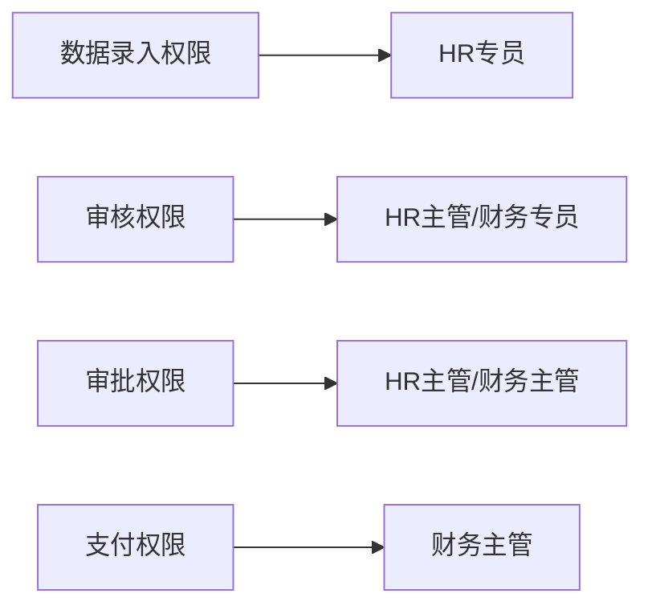
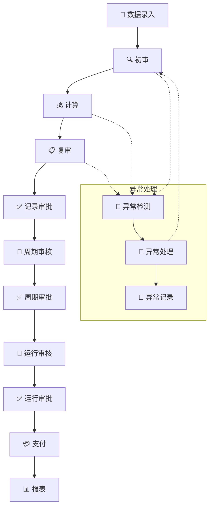
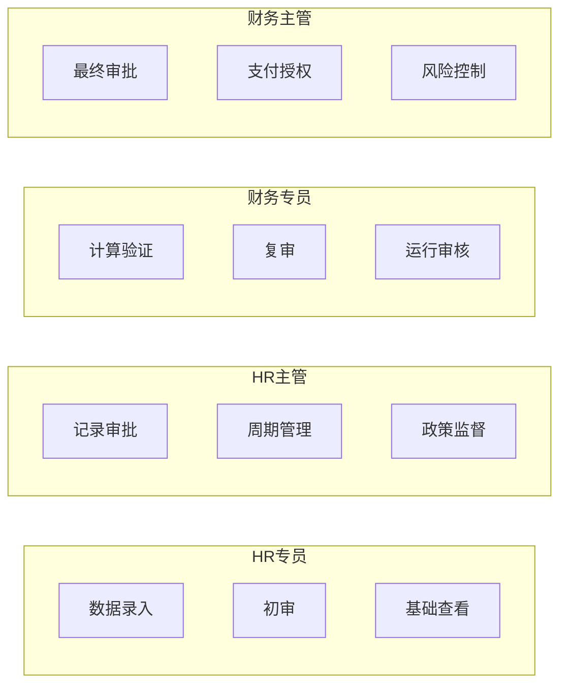

# 工资审批流程规范

## 📋 目录

1. [流程概述](#流程概述)
2. [流程步骤详解](#流程步骤详解)
3. [角色分工与权限](#角色分工与权限)
4. [关键控制点](#关键控制点)
5. [系统权限配置](#系统权限配置)
6. [异常处理机制](#异常处理机制)
7. [优化建议](#优化建议)
8. [附录](#附录)

---

## 🎯 流程概述

### 📝 文档目的
本文档旨在规范高新区工资信息管理系统的工资审批流程，确保工资发放的准确性、合规性和安全性。

### 🔄 流程原则
- **四眼原则**：关键环节需要不同角色确认
- **权限分离**：录入、审核、支付权限分离  
- **审计跟踪**：所有操作留存完整日志
- **风险控制**：多层次审批和异常预警

### 📊 流程状态
工资审批流程包含以下主要状态：
- `DRAFT` (草稿) - 初始录入状态
- `PENDING_CALCULATION` (待计算) - 等待系统计算
- `CALCULATED` (已计算) - 计算完成待审核
- `APPROVED_FOR_PAYMENT` (批准支付) - 审批通过可支付
- `PAID` (已支付) - 支付完成

---

## 🔄 流程步骤详解

### 第一阶段：数据准备
#### 1. 📝 工资数据录入/导入
**执行角色：** HR专员  
**主要任务：**
- 批量导入工资数据（Excel/CSV格式）
- 手工录入特殊项目和调整
- 验证员工基础信息完整性
- 检查薪资组件配置

**系统操作：**
```typescript
// 相关权限
P_PAYROLL_ENTRY_CREATE = 'payroll_entry:manage'
P_PAYROLL_ENTRY_BULK_IMPORT = 'payroll_entry:bulk_import'
```

**质量标准：**
- 数据完整率 ≥ 95%
- 格式错误率 ≤ 2%
- 重复数据率 = 0%

#### 2. 🔍 工资记录初审
**执行角色：** HR专员  
**主要任务：**
- 数据完整性检查
- 基础规则验证（如最低工资标准）
- 异常数据标记和处理
- 与上期数据对比分析

**检查项目：**
- 员工信息完整性
- 薪资组件合规性
- 数值范围合理性
- 计算公式正确性

### 第二阶段：计算处理
#### 3. 💰 工资计算
**执行角色：** 系统自动 + 财务专员验证  
**主要任务：**
- 自动计算各项收入扣除
- 个人所得税计算
- 社保公积金计算
- 其他法定扣除计算

**计算组件：**
- 基本工资
- 岗位津贴
- 绩效奖金
- 各类补贴
- 个税扣除
- 社保扣除

#### 4. 📋 工资记录复审
**执行角色：** 财务专员  
**主要任务：**
- 计算结果验证
- 异常数据深度分析
- 与预算执行情况对比
- 合规性检查

**验证重点：**
- 计算准确性
- 政策合规性
- 预算控制
- 异常波动分析

### 第三阶段：审批确认
#### 5. ✅ 工资记录审批
**执行角色：** HR主管  
**主要任务：**
- 确认工资记录准确性
- 审核特殊调整合理性
- 批准进入下一环节
- 记录审批意见

**审批标准：**
- 数据准确性达标
- 政策执行到位
- 特殊情况有依据
- 预算执行合规

#### 6. 📅 工资周期审核
**执行角色：** HR主管  
**主要任务：**
- 整体周期数据检查
- 预算执行情况审核
- 人员变动影响分析
- 政策调整影响评估

**审核维度：**
- 总体预算控制
- 人员结构分析
- 成本变动趋势
- 政策执行效果

#### 7. ✅ 工资周期审批
**执行角色：** HR主管  
**主要任务：**
- 周期级别的最终确认
- 授权进入运行阶段
- 确认支付计划
- 风险评估确认

### 第四阶段：支付处理
#### 8. 🏃 工资运行审核
**执行角色：** 财务专员  
**主要任务：**
- 支付前最后检查
- 银行文件生成验证
- 资金充足性确认
- 支付风险评估

**检查清单：**
- 银行账户信息准确
- 支付金额核对无误
- 资金账户余额充足
- 支付时间安排合理

#### 9. ✅ 工资运行审批
**执行角色：** 财务主管  
**主要任务：**
- 最终支付授权
- 风险控制确认
- 支付指令下达
- 应急预案准备

**授权条件：**
- 所有审核环节通过
- 风险评估可控
- 资金安排到位
- 应急机制就绪

#### 10. 💳 支付处理
**执行角色：** 财务专员 + 银行系统  
**主要任务：**
- 银行文件导出
- 支付指令执行
- 支付状态更新
- 异常处理跟进

#### 11. 📊 报表生成
**执行角色：** 系统自动 + 各角色查看  
**主要任务：**
- 各类统计报表生成
- 合规性报告输出
- 成本分析报告
- 审计跟踪报告

---

## 👥 角色分工与权限

### 🏢 HR专员 (数据管理层)
**角色定位：** 工资数据的第一责任人，负责数据录入和初步审核

**主要职责：**
- 📝 工资数据录入和批量导入
- 🔍 工资记录初审和基础验证
- 📋 员工信息维护和更新
- 📞 异常情况沟通协调
- 📊 基础数据统计分析

**操作权限：**
```typescript
// 薪资条目权限
P_PAYROLL_ENTRY_VIEW = 'payroll_entry:view'
P_PAYROLL_ENTRY_CREATE = 'payroll_entry:manage'
P_PAYROLL_ENTRY_BULK_IMPORT = 'payroll_entry:bulk_import'
P_PAYROLL_ENTRY_EDIT_DETAILS = 'payroll_entry:edit_details'

// 薪资组件权限
P_PAYROLL_COMPONENT_VIEW = 'payroll_component:view'
```

**工作标准：**
- 数据录入准确率 ≥ 98%
- 初审完成时限 ≤ 2个工作日
- 异常处理响应时间 ≤ 4小时

### 👨‍💼 HR主管 (业务审核层)
**角色定位：** 人力资源业务的审核决策者，确保政策执行到位

**主要职责：**
- ✅ 工资记录审批确认
- 📅 工资周期审核和管理
- 🔄 流程节点控制
- 📊 人力成本分析
- 🎯 政策执行监督

**操作权限：**
```typescript
// 薪资周期权限
P_PAYROLL_PERIOD_VIEW = 'payroll_period:view'
P_PAYROLL_PERIOD_MANAGE = 'payroll_period:manage'

// 薪资运行权限
P_PAYROLL_RUN_VIEW = 'payroll_run:view'
P_PAYROLL_RUN_MANAGE = 'payroll_run:manage'

// 薪资组件权限
P_PAYROLL_COMPONENT_MANAGE = 'payroll_component:manage'
```

**决策标准：**
- 政策合规性100%
- 预算执行偏差 ≤ 5%
- 审批处理时限 ≤ 1个工作日

### 💼 财务专员 (计算验证层)
**角色定位：** 财务计算的执行者和验证者，确保计算准确性

**主要职责：**
- 💰 工资计算执行和验证
- 📋 计算结果复审
- 🏃 工资运行审核
- 📈 财务数据核对
- 🔍 异常数据分析

**操作权限：**
```typescript
// 薪资运行权限
P_PAYROLL_RUN_VIEW = 'payroll_run:view'
P_PAYROLL_RUN_MANAGE = 'payroll_run:manage'

// 薪资条目权限
P_PAYROLL_ENTRY_VIEW = 'payroll_entry:view'
P_PAYROLL_ENTRY_EDIT_DETAILS = 'payroll_entry:edit_details'

// 报表权限
P_PAYROLL_REPORT_VIEW = 'payroll_report:view'
```

**质量要求：**
- 计算准确率 = 100%
- 复审完成时限 ≤ 1个工作日
- 异常识别率 ≥ 95%

### 🏛️ 财务主管 (最终审批层)
**角色定位：** 财务风险的最终把关者，拥有支付授权权限

**主要职责：**
- ✅ 工资运行最终审批
- 💳 支付授权和风险控制
- 📊 预算执行监控
- 🔒 合规性最终把关
- 🚨 风险预警和应急处理

**操作权限：**
```typescript
// 支付相关权限
P_PAYROLL_RUN_MARK_AS_PAID = 'payroll_run:mark_paid'
P_PAYROLL_RUN_EXPORT_BANK_FILE = 'payroll_run:export_bank'

// 全面查看权限
P_PAYROLL_MODULE_VIEW = 'payroll_run:view'
P_PAYROLL_REPORT_MANAGE = 'payroll_report:manage'
```

**授权标准：**
- 风险评估通过
- 资金安排到位
- 合规检查无误
- 应急预案就绪

### 📈 管理层 (决策支持层)
**角色定位：** 战略决策的支持者，关注整体成本和效益

**主要职责：**
- 📊 各类报表查看和分析
- 💡 政策决策支持
- 📈 成本控制和预算管理
- 🎯 绩效考核参考
- 🔮 趋势分析和预测

**查看权限：**
```typescript
// 报表查看权限
P_PAYROLL_REPORT_VIEW = 'payroll_report:view'
P_PAYROLL_DASHBOARD_VIEW = 'payroll_dashboard:view'

// 统计分析权限
P_PAYROLL_ANALYTICS_VIEW = 'payroll_analytics:view'
```

---

## 🔐 关键控制点

### ⚠️ 必须审批的环节

#### 1. 工资记录审批
**控制目标：** 确保数据准确性和政策合规性
**审批角色：** HR主管
**审批条件：**
- 数据完整性检查通过
- 计算结果验证无误
- 特殊调整有合理依据
- 预算执行在控制范围内

#### 2. 工资周期审批
**控制目标：** 控制整体发放规模和时机
**审批角色：** HR主管
**审批条件：**
- 周期内所有记录审核完成
- 总体预算执行合规
- 人员变动影响已评估
- 政策调整已充分考虑

#### 3. 工资运行审批
**控制目标：** 最终支付授权和风险控制
**审批角色：** 财务主管
**审批条件：**
- 所有前置审核环节通过
- 资金账户余额充足
- 银行文件生成无误
- 风险评估结果可控

### 🛡️ 风险控制机制

#### 四眼原则实施
- **数据录入 vs 初审**：HR专员录入，HR专员（不同人）初审
- **计算 vs 复审**：系统计算，财务专员复审
- **审核 vs 审批**：专员审核，主管审批
- **生成 vs 授权**：专员生成支付文件，主管授权支付

#### 权限分离控制


#### 审计跟踪要求
- **操作日志**：记录所有用户操作和时间戳
- **状态变更**：记录每次状态变更的原因和操作人
- **审批意见**：保存每个审批环节的意见和依据
- **异常记录**：详细记录异常处理过程和结果

#### 异常预警机制
- **超标准预警**：薪资组件超出标准范围自动提醒
- **超预算预警**：总额超出预算限额自动阻止
- **异常波动预警**：个人薪资异常变动自动标记
- **时限预警**：审批超时自动提醒相关人员

---

## 💻 系统权限配置

### 🔑 权限矩阵表

| 权限代码 | 权限名称 | HR专员 | HR主管 | 财务专员 | 财务主管 | 管理层 |
|---------|---------|--------|--------|----------|----------|--------|
| `payroll_entry:view` | 查看薪资条目 | ✅ | ✅ | ✅ | ✅ | ✅ |
| `payroll_entry:manage` | 管理薪资条目 | ✅ | ✅ | ❌ | ❌ | ❌ |
| `payroll_entry:bulk_import` | 批量导入薪资 | ✅ | ✅ | ❌ | ❌ | ❌ |
| `payroll_entry:edit_details` | 编辑薪资详情 | ✅ | ✅ | ✅ | ❌ | ❌ |
| `payroll_period:view` | 查看薪资周期 | ✅ | ✅ | ✅ | ✅ | ✅ |
| `payroll_period:manage` | 管理薪资周期 | ❌ | ✅ | ❌ | ❌ | ❌ |
| `payroll_run:view` | 查看薪资运行 | ✅ | ✅ | ✅ | ✅ | ✅ |
| `payroll_run:manage` | 管理薪资运行 | ❌ | ✅ | ✅ | ✅ | ❌ |
| `payroll_run:mark_paid` | 标记已支付 | ❌ | ❌ | ❌ | ✅ | ❌ |
| `payroll_run:export_bank` | 导出银行文件 | ❌ | ❌ | ❌ | ✅ | ❌ |
| `payroll_component:view` | 查看薪资组件 | ✅ | ✅ | ✅ | ✅ | ✅ |
| `payroll_component:manage` | 管理薪资组件 | ❌ | ✅ | ❌ | ❌ | ❌ |
| `payroll_report:view` | 查看薪资报表 | ✅ | ✅ | ✅ | ✅ | ✅ |
| `payroll_report:manage` | 管理薪资报表 | ❌ | ❌ | ❌ | ✅ | ✅ |

### 🔒 角色权限配置示例

```sql
-- HR专员角色权限
INSERT INTO security.role_permissions (role_id, permission_code) VALUES 
(1, 'payroll_entry:view'),
(1, 'payroll_entry:manage'),
(1, 'payroll_entry:bulk_import'),
(1, 'payroll_entry:edit_details'),
(1, 'payroll_period:view'),
(1, 'payroll_run:view'),
(1, 'payroll_component:view'),
(1, 'payroll_report:view');

-- HR主管角色权限
INSERT INTO security.role_permissions (role_id, permission_code) VALUES 
(2, 'payroll_period:manage'),
(2, 'payroll_run:manage'),
(2, 'payroll_component:manage');

-- 财务主管角色权限
INSERT INTO security.role_permissions (role_id, permission_code) VALUES 
(4, 'payroll_run:mark_paid'),
(4, 'payroll_run:export_bank'),
(4, 'payroll_report:manage');
```

---

## 🚨 异常处理机制

### 📋 异常分类

#### 1. 数据异常
**异常类型：**
- 数据缺失或不完整
- 数据格式错误
- 数值超出合理范围
- 重复数据

**处理流程：**
1. 系统自动检测并标记异常数据
2. HR专员收到异常提醒并进行处理
3. 修正后重新提交审核
4. 记录异常处理过程

#### 2. 计算异常
**异常类型：**
- 计算公式错误
- 税率配置错误
- 社保基数异常
- 扣除项目错误

**处理流程：**
1. 财务专员发现计算异常
2. 暂停当前流程并分析原因
3. 修正计算配置或公式
4. 重新计算并验证结果

#### 3. 审批异常
**异常类型：**
- 审批超时
- 审批人员不可用
- 审批权限不足
- 审批流程中断

**处理流程：**
1. 系统自动检测审批异常
2. 发送提醒给相关人员
3. 启动应急审批机制
4. 记录异常处理结果

#### 4. 支付异常
**异常类型：**
- 银行账户信息错误
- 资金不足
- 银行系统故障
- 支付文件格式错误

**处理流程：**
1. 财务主管发现支付异常
2. 立即暂停支付操作
3. 分析异常原因并制定解决方案
4. 修正后重新执行支付

### ⏰ 时限控制

| 环节 | 标准时限 | 超时预警 | 强制升级 |
|------|----------|----------|----------|
| 数据录入 | 2个工作日 | 1.5个工作日 | 3个工作日 |
| 初审 | 1个工作日 | 0.5个工作日 | 2个工作日 |
| 计算 | 4小时 | 2小时 | 8小时 |
| 复审 | 1个工作日 | 0.5个工作日 | 2个工作日 |
| 记录审批 | 1个工作日 | 0.5个工作日 | 2个工作日 |
| 周期审批 | 1个工作日 | 0.5个工作日 | 2个工作日 |
| 运行审批 | 4小时 | 2小时 | 8小时 |
| 支付处理 | 2小时 | 1小时 | 4小时 |

### 🔔 预警机制

#### 自动预警规则
```typescript
// 预警配置示例
const alertRules = {
  // 金额异常预警
  amountAlert: {
    maxIncrease: 0.3,  // 个人薪资增幅超过30%
    maxDecrease: 0.2,  // 个人薪资降幅超过20%
    budgetOverrun: 0.05 // 预算超支5%
  },
  
  // 时限预警
  timeAlert: {
    approvalOverdue: 24, // 审批超时24小时
    calculationDelay: 4, // 计算延迟4小时
    paymentDelay: 2      // 支付延迟2小时
  },
  
  // 数据质量预警
  qualityAlert: {
    missingDataRate: 0.02, // 缺失数据率超过2%
    errorDataRate: 0.01,   // 错误数据率超过1%
    duplicateDataRate: 0   // 重复数据率大于0
  }
};
```

---

## 🚀 优化建议

### 📈 流程优化建议

#### 1. 并行处理优化
**当前问题：** 某些环节串行处理导致效率低下
**优化方案：**
- 数据录入和基础验证可以并行进行
- 不同部门的数据可以分批并行审核
- 报表生成可以在支付确认后立即开始

#### 2. 自动化程度提升
**当前问题：** 人工操作环节较多，容易出错
**优化方案：**
- 增加更多自动验证规则
- 实现智能异常检测
- 自动生成审批提醒和报告

#### 3. 移动端支持
**当前问题：** 审批人员需要在电脑前操作
**优化方案：**
- 开发移动端审批应用
- 支持扫码快速审批
- 提供离线审批功能

### 💻 系统增强建议

#### 1. 流程可视化
```typescript
// 流程状态可视化组件
const WorkflowVisualization = {
  currentStep: 'payroll_calculation',
  completedSteps: ['data_entry', 'initial_review'],
  pendingSteps: ['calculation_review', 'record_approval'],
  estimatedCompletion: '2024-01-15 18:00'
};
```

#### 2. 智能提醒系统
- **个性化提醒**：根据用户角色定制提醒内容
- **多渠道通知**：邮件、短信、系统内消息
- **智能调度**：根据工作时间和紧急程度调整提醒频率

#### 3. 数据分析增强
- **趋势分析**：薪资成本变化趋势
- **异常分析**：自动识别异常模式
- **预测分析**：基于历史数据预测未来成本

### 🔒 安全性增强

#### 1. 多因素认证
- 关键操作需要二次验证
- 支付操作需要多人授权
- 敏感数据访问需要额外认证

#### 2. 数据加密
- 薪资数据传输加密
- 数据库存储加密
- 备份文件加密

#### 3. 访问控制
- 基于时间的访问控制
- 基于地理位置的访问限制
- 异常访问行为监控

---

## 📚 附录

### 📊 流程图表

#### 完整流程图


#### 角色权限矩阵图


### 📋 检查清单

#### 数据录入检查清单
- [ ] 员工信息完整性
- [ ] 薪资组件配置正确
- [ ] 数据格式符合要求
- [ ] 无重复数据
- [ ] 特殊调整有依据

#### 审批检查清单
- [ ] 计算结果准确
- [ ] 政策执行到位
- [ ] 预算控制合规
- [ ] 异常情况已处理
- [ ] 审批权限充足

#### 支付检查清单
- [ ] 银行信息准确
- [ ] 支付金额核对
- [ ] 资金余额充足
- [ ] 支付文件格式正确
- [ ] 风险评估通过

### 📞 联系信息

#### 技术支持
- **系统管理员**：admin@company.com
- **技术热线**：400-xxx-xxxx
- **在线支持**：https://support.company.com

#### 业务咨询
- **HR部门**：hr@company.com
- **财务部门**：finance@company.com
- **管理层**：management@company.com

### 📅 版本历史

| 版本 | 日期 | 修改内容 | 修改人 |
|------|------|----------|--------|
| v1.0 | 2024-01-10 | 初始版本创建 | 系统管理员 |
| v1.1 | 2024-01-15 | 增加异常处理机制 | 业务分析师 |
| v1.2 | 2024-01-20 | 优化权限配置 | 安全专员 |

---

**文档状态：** ✅ 已发布  
**最后更新：** 2024-01-20  
**下次审核：** 2024-04-20  
**文档所有者：** 人力资源部 & 财务部 