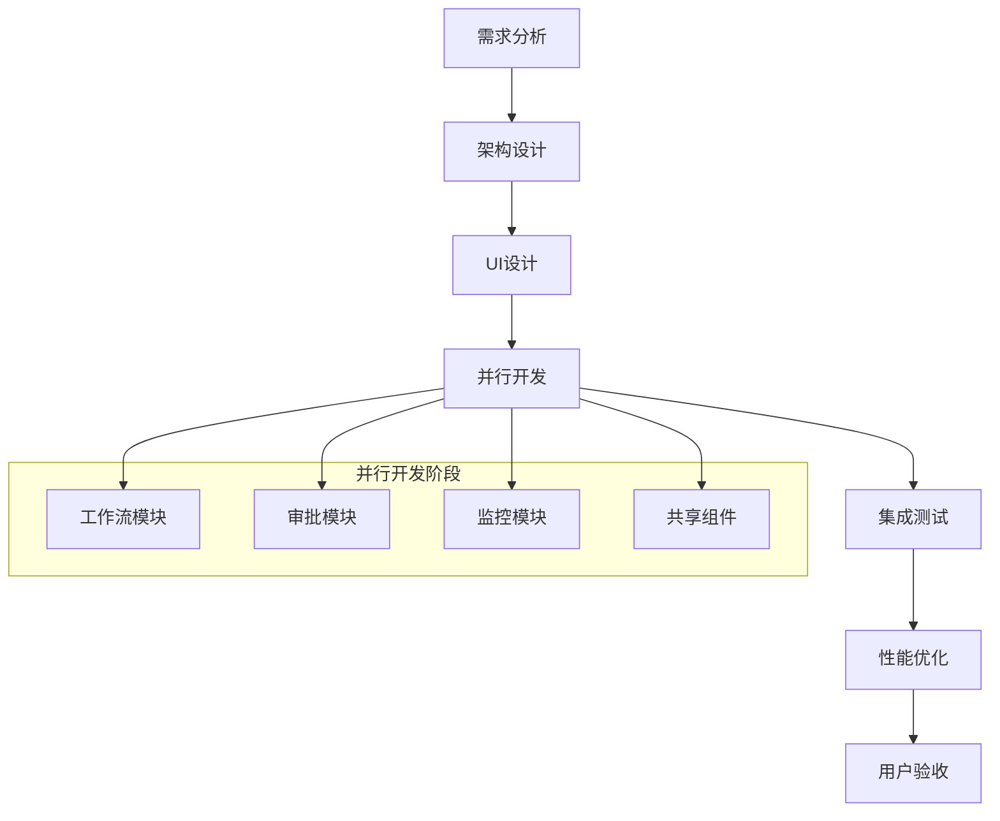

# 工资审批流程前端开发团队资源评估报告

## 📋 目录

1. [项目概述](#项目概述)
2. [团队配置方案](#团队配置方案)
3. [人员职责分工](#人员职责分工)
4. [开发周期规划](#开发周期规划)
5. [成本预算分析](#成本预算分析)
6. [风险评估与缓解](#风险评估与缓解)
7. [推荐方案](#推荐方案)
8. [附录](#附录)

---

## 🎯 项目概述

### 📝 项目背景
基于高新区工资信息管理系统的工资审批流程规范，需要开发一套完整的前端工作流系统，实现11步工资审批流程的数字化管理。

### 🎯 项目目标
- 🔄 可视化流程管理：清晰展示11个审批步骤的状态和进度
- ✅ 高效审批操作：支持批量审批、委托、退回等操作
- 📊 实时状态监控：实时更新流程状态和性能指标
- 🔐 精细权限控制：基于角色的访问控制和操作权限
- 📱 响应式用户界面：支持PC端和移动端操作

### 📊 技术复杂度评估
- **业务复杂度**：⭐⭐⭐⭐⭐ (5/5) - 11步审批流程，多角色权限控制
- **技术复杂度**：⭐⭐⭐⭐ (4/5) - React生态，实时通信，状态管理
- **UI复杂度**：⭐⭐⭐⭐ (4/5) - 工作流可视化，数据图表，响应式设计
- **集成复杂度**：⭐⭐⭐ (3/5) - 与现有薪资系统集成

---

## 👥 团队配置方案

### 🥇 方案一：最优团队配置（5-6人）

#### 核心开发团队（4人）

**🏗️ 前端架构师/技术负责人 × 1**
```
角色定位：技术决策者和架构设计者
核心职责：
├── 整体技术架构设计和技术选型
├── 核心组件框架搭建和代码规范制定
├── 技术难点攻关和性能优化
├── 代码Review和质量把控
└── 团队技术指导和培训

技能要求：
├── React生态：5+ 年开发经验，精通React 18、TypeScript
├── 状态管理：熟练掌握Zustand、Redux等状态管理方案
├── 工程化：webpack/vite、ESLint、测试框架等
├── 架构能力：有大型前端项目架构经验
└── 业务理解：熟悉工作流系统和企业级应用

工作量分配：
├── 架构设计：20%
├── 核心开发：40%
├── 代码Review：20%
└── 技术指导：20%
```

**💻 高级前端工程师A × 1（工作流模块负责人）**
```
角色定位：工作流核心模块开发负责人
核心职责：
├── 工作流核心模块（workflow/）开发
├── WorkflowStatusCard、WorkflowTimeline组件开发
├── WorkflowDashboard、WorkflowDetail页面开发
├── 状态管理和实时通信功能实现
└── 与后端API接口对接

技能要求：
├── React开发：3+ 年经验，熟练掌握Hooks、Context
├── 组件库：精通Ant Design，有自定义组件开发经验
├── 数据管理：熟悉React Query、SWR等数据获取方案
├── 实时通信：了解WebSocket、Socket.io
└── 工作流理解：有工作流或审批系统开发经验

开发模块：
├── WorkflowStatusCard：流程状态卡片
├── WorkflowTimeline：流程时间线
├── WorkflowDashboard：工作流仪表板
├── WorkflowDetail：流程详情页面
└── 实时通信：WebSocket集成
```

**✅ 高级前端工程师B × 1（审批模块负责人）**
```
角色定位：审批功能模块开发负责人
核心职责：
├── 审批专用模块（approval/）开发
├── ApprovalPanel、ApprovalCenter组件开发
├── 批量操作和权限控制功能实现
├── 审批历史和报告页面开发
└── 权限系统与业务逻辑集成

技能要求：
├── React开发：3+ 年经验，熟悉复杂表单处理
├── 权限控制：有RBAC权限系统开发经验
├── 批量操作：熟悉大数据量处理和性能优化
├── 表单处理：精通Ant Design Form、表单验证
└── 业务逻辑：有企业级审批系统开发经验

开发模块：
├── ApprovalPanel：审批操作面板
├── ApprovalCenter：审批中心页面
├── BatchApproval：批量审批功能
├── ApprovalHistory：审批历史查询
└── 权限控制：基于角色的访问控制
```

**📊 中级前端工程师 × 1（监控与共享模块负责人）**
```
角色定位：监控分析和共享组件开发者
核心职责：
├── 监控分析模块（monitoring/）开发
├── 共享组件库（shared/）建设
├── 数据可视化图表实现
├── 移动端适配和响应式优化
└── 性能监控和优化

技能要求：
├── React开发：2+ 年经验，熟悉组件化开发
├── 数据可视化：熟练使用ECharts、D3.js等图表库
├── 响应式设计：CSS3、媒体查询、移动端适配
├── 性能优化：了解前端性能优化最佳实践
└── 工具使用：熟悉构建工具和调试工具

开发模块：
├── MonitoringDashboard：监控仪表板
├── MetricsChart：性能指标图表
├── AlertPanel：预警面板
├── 共享组件：通用UI组件
└── 移动端适配：响应式布局
```

#### 支持团队（2人）

**🎨 UI/UX设计师 × 1**
```
角色定位：用户体验和界面设计专家
核心职责：
├── 工作流界面设计和交互原型制作
├── 设计规范制定和组件设计系统
├── 用户体验优化和可用性测试
├── 与开发团队协作确保设计落地
└── 移动端界面设计和适配方案

技能要求：
├── 设计工具：精通Figma、Sketch、Adobe XD
├── 交互设计：有企业级系统UI/UX设计经验
├── 设计系统：熟悉Ant Design设计语言
├── 用户研究：了解用户体验设计方法论
└── 协作能力：与开发团队良好沟通协作

工作内容：
├── 界面设计：工作流各页面界面设计
├── 交互原型：高保真交互原型制作
├── 设计规范：建立设计系统和规范
├── 用户测试：参与用户体验测试
└── 设计评审：定期设计评审和优化
```

**🧪 测试工程师 × 1**
```
角色定位：质量保证和自动化测试专家
核心职责：
├── 测试用例设计和测试计划制定
├── 自动化测试脚本开发和维护
├── 性能测试和兼容性测试
├── 用户验收测试和回归测试
└── 测试报告和质量分析

技能要求：
├── 测试框架：熟练使用Jest、Cypress、Playwright
├── 自动化测试：有前端自动化测试经验
├── 性能测试：了解前端性能测试工具和方法
├── 测试设计：有复杂业务系统测试经验
└── 工具使用：熟悉测试管理和缺陷跟踪工具

工作内容：
├── 测试计划：制定详细测试计划和策略
├── 用例设计：编写全面的测试用例
├── 自动化测试：开发和维护自动化测试脚本
├── 性能测试：进行性能基准测试和优化
└── 质量报告：定期输出质量分析报告
```

### 🥈 方案二：平衡团队配置（4人）

**适用场景：** 预算有限，但仍需保证项目质量

**团队构成：**
- 全栈技术负责人 × 1（承担架构师 + 高级工程师职责）
- 前端工程师 × 2（分别负责工作流模块和审批模块）
- UI设计师 × 1（兼职或外包）

### 🥉 方案三：精简团队配置（3人）

**适用场景：** 预算紧张，项目周期可以适当延长

**团队构成：**
- 技术负责人 × 1（全栈开发 + 架构设计）
- 前端工程师 × 2（分工负责主要模块）
- UI设计师（外包或兼职）

--- 

## 👨‍💼 人员职责分工

### 📋 详细职责矩阵

| 职责领域 | 架构师 | 高级工程师A | 高级工程师B | 中级工程师 | UI设计师 | 测试工程师 |
|---------|--------|-------------|-------------|------------|----------|------------|
| **架构设计** | 🟢 主责 | 🟡 参与 | 🟡 参与 | ⚪ 了解 | ⚪ 了解 | ⚪ 了解 |
| **工作流模块** | 🟡 指导 | 🟢 主责 | ⚪ 协助 | 🟡 参与 | 🟡 设计 | 🟡 测试 |
| **审批模块** | 🟡 指导 | ⚪ 协助 | 🟢 主责 | 🟡 参与 | 🟡 设计 | 🟡 测试 |
| **监控模块** | 🟡 指导 | ⚪ 协助 | ⚪ 协助 | 🟢 主责 | 🟡 设计 | 🟡 测试 |
| **共享组件** | 🟡 规范 | 🟡 参与 | 🟡 参与 | 🟢 主责 | 🟡 设计 | 🟡 测试 |
| **UI设计** | ⚪ 评审 | ⚪ 评审 | ⚪ 评审 | ⚪ 评审 | 🟢 主责 | ⚪ 验证 |
| **质量保证** | 🟡 Review | 🟡 自测 | 🟡 自测 | 🟡 自测 | ⚪ 配合 | 🟢 主责 |
| **性能优化** | 🟢 主责 | 🟡 参与 | 🟡 参与 | 🟡 参与 | ⚪ 配合 | 🟡 测试 |

**图例：** 🟢 主要责任 🟡 参与协作 ⚪ 了解配合

### 🔄 工作流程协作



---

## ⏰ 开发周期规划

### 📅 总体时间安排（8-11周）

#### 🎯 第一阶段：项目启动与架构设计（1周）
```
Week 1: 项目启动
├── 需求澄清和技术调研（2天）
├── 技术架构设计和选型（2天）
└── 开发环境搭建和规范制定（1天）

参与人员：全员
关键产出：
├── 技术架构文档
├── 开发规范和代码标准
├── 项目脚手架和基础配置
└── UI设计规范和组件库框架
```

#### 🔧 第二阶段：核心组件开发（2-3周）
```
Week 2-4: 核心组件开发
├── 基础组件库搭建（架构师 + 中级工程师）
├── WorkflowStatusCard 开发（高级工程师A）
├── WorkflowTimeline 开发（高级工程师A）
├── ApprovalPanel 开发（高级工程师B）
├── ProcessProgress 开发（中级工程师）
├── 状态管理框架搭建（架构师）
└── UI设计和交互原型（UI设计师）

并行任务：
├── 组件单元测试（测试工程师）
├── API接口设计和Mock（架构师）
└── 设计系统建立（UI设计师）
```

#### 📱 第三阶段：页面开发与集成（2-3周）
```
Week 5-7: 页面开发
├── WorkflowDashboard 开发（高级工程师A）
├── ApprovalCenter 开发（高级工程师B）
├── MonitoringDashboard 开发（中级工程师）
├── WorkflowHistory 开发（高级工程师A）
├── 权限控制集成（高级工程师B）
└── 响应式适配（中级工程师）

集成任务：
├── 模块间集成测试（测试工程师）
├── API接口联调（全员）
└── 性能基准测试（架构师 + 测试工程师）
```

#### 🚀 第四阶段：高级功能与优化（2-3周）
```
Week 8-10: 高级功能
├── 实时通知系统（架构师 + 高级工程师A）
├── 批量操作功能（高级工程师B）
├── 数据可视化图表（中级工程师）
├── 移动端优化（中级工程师）
├── 性能优化和缓存策略（架构师）
└── 用户体验优化（UI设计师）

质量保证：
├── 自动化测试完善（测试工程师）
├── 兼容性测试（测试工程师）
├── 压力测试和性能调优（架构师 + 测试工程师）
└── 用户验收测试（全员）
```

#### ✅ 第五阶段：测试与发布（1周）
```
Week 11: 测试与发布
├── 回归测试和Bug修复（全员）
├── 文档完善和交付（架构师）
├── 部署和上线准备（架构师）
└── 用户培训和支持（全员）
```

### 📊 里程碑节点

| 里程碑 | 时间节点 | 关键产出 | 验收标准 |
|--------|----------|----------|----------|
| **M1: 架构完成** | Week 1 | 技术架构、开发环境 | 架构评审通过 |
| **M2: 核心组件** | Week 4 | 基础组件库、核心组件 | 组件功能测试通过 |
| **M3: 页面集成** | Week 7 | 主要页面、模块集成 | 集成测试通过 |
| **M4: 功能完整** | Week 10 | 全部功能、性能优化 | 功能测试通过 |
| **M5: 项目交付** | Week 11 | 最终产品、文档交付 | 用户验收通过 |

---

## 💰 成本预算分析

### 🏢 一线城市成本预算（北京/上海/深圳）

#### 方案一：最优团队配置（5-6人）
```
人员成本（月薪）：
├── 前端架构师：        30,000元/月
├── 高级前端工程师A：   22,000元/月
├── 高级前端工程师B：   22,000元/月
├── 中级前端工程师：    15,000元/月
├── UI/UX设计师：       18,000元/月
└── 测试工程师：        15,000元/月

月度总成本：122,000元
项目周期：2.5个月（11周）
总人力成本：305,000元

其他成本：
├── 设备和软件：20,000元
├── 培训和学习：10,000元
├── 项目管理：15,000元
└── 风险缓冲：30,000元

项目总预算：380,000元
```

#### 方案二：平衡团队配置（4人）
```
人员成本（月薪）：
├── 技术负责人：        28,000元/月
├── 前端工程师A：       20,000元/月
├── 前端工程师B：       18,000元/月
└── UI设计师：          16,000元/月

月度总成本：82,000元
项目周期：3个月（12周）
总人力成本：246,000元

其他成本：
├── 设备和软件：15,000元
├── 培训和学习：8,000元
├── 项目管理：12,000元
└── 风险缓冲：25,000元

项目总预算：306,000元
```

#### 方案三：精简团队配置（3人）
```
人员成本（月薪）：
├── 技术负责人：        25,000元/月
├── 前端工程师A：       18,000元/月
└── 前端工程师B：       16,000元/月

月度总成本：59,000元
项目周期：4个月（16周）
总人力成本：236,000元

其他成本：
├── 设备和软件：12,000元
├── 外包UI设计：25,000元
├── 项目管理：10,000元
└── 风险缓冲：23,000元

项目总预算：306,000元
```

### 🏙️ 二线城市成本预算

#### 方案一：最优团队配置（5-6人）
```
人员成本（月薪）：
├── 前端架构师：        20,000元/月
├── 高级前端工程师A：   15,000元/月
├── 高级前端工程师B：   15,000元/月
├── 中级前端工程师：    10,000元/月
├── UI/UX设计师：       12,000元/月
└── 测试工程师：        10,000元/月

月度总成本：82,000元
项目周期：2.5个月（11周）
总人力成本：205,000元

项目总预算：260,000元
```

### 📊 成本效益分析

| 方案 | 总预算 | 开发周期 | 质量等级 | 风险等级 | 推荐指数 |
|------|--------|----------|----------|----------|----------|
| **最优配置** | 380K | 11周 | ⭐⭐⭐⭐⭐ | ⭐⭐ | ⭐⭐⭐⭐⭐ |
| **平衡配置** | 306K | 12周 | ⭐⭐⭐⭐ | ⭐⭐⭐ | ⭐⭐⭐⭐ |
| **精简配置** | 306K | 16周 | ⭐⭐⭐ | ⭐⭐⭐⭐ | ⭐⭐⭐ |

--- 

## ⚠️ 风险评估与缓解

### 🚨 主要风险识别

#### 1. 技术风险
**风险描述：**
- 工作流系统业务逻辑复杂，技术实现难度高
- 实时通信和状态同步技术挑战
- 大数据量处理性能问题

**风险等级：** 🔴 高风险

**缓解措施：**
- 技术预研：提前验证关键技术点和难点
- 原型开发：先开发MVP验证技术可行性
- 技术储备：团队提前学习相关技术栈
- 专家咨询：必要时引入外部技术专家

#### 2. 人员风险
**风险描述：**
- 团队成员技能水平参差不齐
- 关键人员离职或不可用
- 团队协作磨合期较长

**风险等级：** 🟡 中风险

**缓解措施：**
- 技能评估：项目前进行详细技能评估
- 知识分享：建立代码Review和技术分享机制
- 文档完善：关键技术和业务逻辑详细文档化
- 备用方案：关键岗位准备备选人员

#### 3. 需求风险
**风险描述：**
- 业务需求理解偏差
- 需求变更频繁
- 用户体验期望过高

**风险等级：** 🟡 中风险

**缓解措施：**
- 需求澄清：项目初期深度需求调研和确认
- 原型验证：通过原型验证需求理解正确性
- 变更控制：建立需求变更评估和审批流程
- 分期交付：采用敏捷开发，分期交付验证

#### 4. 进度风险
**风险描述：**
- 开发进度延期
- 测试时间不足
- 集成问题导致延期

**风险等级：** 🟡 中风险

**缓解措施：**
- 缓冲时间：预留20%的缓冲时间
- 里程碑控制：设置明确的里程碑和检查点
- 并行开发：合理安排并行开发任务
- 持续集成：建立CI/CD流程，及早发现问题

### 📊 风险矩阵

| 风险类型 | 发生概率 | 影响程度 | 风险等级 | 优先级 |
|---------|----------|----------|----------|--------|
| 技术实现难度 | 高 | 高 | 🔴 高 | P1 |
| 关键人员离职 | 中 | 高 | 🟡 中 | P2 |
| 需求变更 | 中 | 中 | 🟡 中 | P3 |
| 进度延期 | 中 | 中 | 🟡 中 | P3 |
| 性能问题 | 低 | 高 | 🟡 中 | P2 |

---

## 🎯 推荐方案

### 🥇 最佳推荐：方案一（最优团队配置）

**推荐理由：**
- ✅ **质量保证**：专业分工，每个模块都有专人负责
- ✅ **风险可控**：团队规模适中，技能覆盖全面
- ✅ **进度可控**：11周完成，时间节点明确
- ✅ **可维护性**：代码质量高，后期维护成本低
- ✅ **扩展性强**：架构设计完善，便于后续功能扩展

**适用场景：**
- 对项目质量要求高
- 预算相对充足（38万）
- 希望快速交付（11周）
- 需要长期维护和扩展

### 🥈 备选推荐：方案二（平衡团队配置）

**推荐理由：**
- ✅ **成本控制**：预算适中（30.6万）
- ✅ **质量平衡**：核心功能质量有保证
- ✅ **风险适中**：团队精简但技能覆盖基本需求
- ⚠️ **进度稍长**：12周完成，比最优方案多1周

**适用场景：**
- 预算有一定限制
- 对质量有要求但可接受适度妥协
- 时间要求不是特别紧急

### 📋 实施建议

#### 🔧 技术准备
1. **技术调研**：React 18、Zustand、Ant Design 5最新特性
2. **环境搭建**：开发、测试、生产环境配置
3. **工具链**：ESLint、Prettier、Jest、Cypress配置
4. **CI/CD**：自动化构建和部署流程

#### 👥 团队准备
1. **技能培训**：针对性技术培训和知识分享
2. **规范制定**：代码规范、Git工作流、Review流程
3. **协作工具**：项目管理、沟通协作工具选择
4. **文档体系**：技术文档、API文档、用户文档

#### 📊 项目管理
1. **敏捷开发**：2周一个迭代，定期回顾和调整
2. **质量控制**：代码Review、自动化测试、性能监控
3. **风险管控**：定期风险评估和应对措施调整
4. **沟通机制**：每日站会、周报、里程碑评审

---

## 📚 附录

### 📋 技能要求清单

#### 前端架构师
- [ ] React 18 + TypeScript 5+ 年经验
- [ ] 状态管理：Zustand/Redux/Context API
- [ ] 构建工具：Vite/Webpack配置和优化
- [ ] 测试框架：Jest/React Testing Library
- [ ] 性能优化：代码分割、懒加载、缓存策略
- [ ] 架构设计：模块化、组件化、微前端
- [ ] 工作流系统：有相关业务系统开发经验

#### 高级前端工程师
- [ ] React + TypeScript 3+ 年经验
- [ ] Ant Design 深度使用经验
- [ ] React Query/SWR 数据管理
- [ ] WebSocket/Socket.io 实时通信
- [ ] 复杂表单处理和验证
- [ ] 权限系统开发经验
- [ ] 企业级应用开发经验

#### 中级前端工程师
- [ ] React + TypeScript 2+ 年经验
- [ ] ECharts/D3.js 数据可视化
- [ ] CSS3/Sass 响应式设计
- [ ] 移动端适配经验
- [ ] 性能优化基础知识
- [ ] 组件库开发经验

#### UI/UX设计师
- [ ] Figma/Sketch 设计工具
- [ ] 企业级系统设计经验
- [ ] Ant Design 设计语言
- [ ] 交互原型设计
- [ ] 用户体验研究方法
- [ ] 与开发团队协作经验

#### 测试工程师
- [ ] Jest/Cypress 自动化测试
- [ ] 前端性能测试
- [ ] 测试用例设计
- [ ] 缺陷管理流程
- [ ] 企业级应用测试经验

### 📊 项目交付物清单

#### 技术交付物
- [ ] 源代码和版本控制
- [ ] 技术架构文档
- [ ] API接口文档
- [ ] 组件库文档
- [ ] 部署和运维文档
- [ ] 测试报告和用例
- [ ] 性能测试报告

#### 业务交付物
- [ ] 用户操作手册
- [ ] 管理员配置手册
- [ ] 培训材料和视频
- [ ] 问题排查指南
- [ ] 系统维护手册

#### 项目管理交付物
- [ ] 项目计划和进度报告
- [ ] 风险评估和应对措施
- [ ] 质量评估报告
- [ ] 项目总结和经验分享

### 📞 联系信息

**项目负责人：** [待定]  
**技术负责人：** [待定]  
**项目经理：** [待定]  

**项目邮箱：** workflow-project@company.com  
**技术支持：** tech-support@company.com  

---

**报告状态：** ✅ 已完成  
**编制日期：** 2024-01-20  
**审核日期：** 2024-01-22  
**批准日期：** [待定]  
**版本号：** v1.0  

**编制人：** 技术团队  
**审核人：** 项目经理  
**批准人：** [待定]  