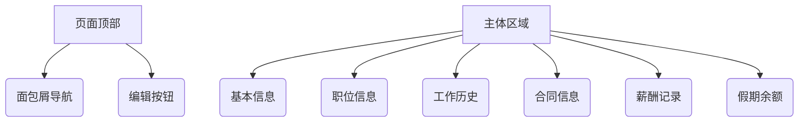

# 工资信息管理系统 - 使用说明

## 员工管理操作手册

### 1. 员工详情页访问
1. 从左侧导航进入`人力资源 > 员工管理`
2. 点击某个员工记录后的`查看详情`按钮

### 2. 页面功能区域说明


### 3. 核心功能操作指南
#### 3.1 基础信息编辑
1. 点击页面右上角`编辑按钮`(铅笔图标)
2. 在表单中修改以下信息：
   - 个人资料（姓名/性别/出生日期）
   - 联系方式（邮箱/手机/住址）
   - 银行账户（开户行/账号）
3. 点击`保存`完成修改

#### 3.2 职位信息变更
1. 切换至`职位信息`标签页
2. 联系HR管理员进行以下操作：
   - 部门调动
   - 岗位调整
   - 雇佣类型变更
   > 变更记录将自动保存到`工作历史`标签页

#### 3.3 合同管理
1. 切换到`合同信息`标签页
2. 可执行操作：
   - 上传新合同(PDF/DOC)
   - 查看历史合同
   - 设置到期提醒
   ```示例
   合同号：HT2025001
   类型：劳动合同
   有效期：2025-01-01 至 2025-12-31
   ```

#### 3.4 薪酬记录查询
1. 切换到`薪酬记录`标签页
2. 查看项目：
   - 基本工资
   - 绩效奖金
   - 补贴金额
   > 所有薪资调整都有记录，格式：`调整日期 | 基本工资 + 绩效奖金 = 总额`

#### 3.5 假期管理
1. 切换到`假期余额`标签页
2. 查看各类型假期：
   | 假期类型 | 年度额度 | 已使用 | 剩余 |
   |---|---|---|---|
   | 年假 | 15天 | 5天 | 10天 |
   | 病假 | 30天 | 2天 | 28天 |

### 4. 权限说明
- **HR专员**：可编辑所有信息
- **部门主管**：仅查看本部门员工
- **普通员工**：仅查看本人信息

### 5. 常见问题
**Q1：为什么某些字段无法编辑？**  
A：灰色字段由系统自动生成或需要特殊权限修改

**Q2：如何查看历史变更记录？**  
A：切换至`工作历史`标签页查看所有岗位变动记录

**Q3：合同到期如何续签？**  
A：合同到期前30天系统自动发送提醒至HR邮箱

## 技术支持
遇到技术问题请联系：  
📧 tech_support@example.com  
☎ 028-12345678