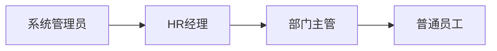

# 工资信息管理系统 - 系统介绍

## 项目概述
本系统为高新区工资信息管理平台，聚焦于员工全生命周期管理。核心功能包括员工信息管理、薪资计算、合同管理等模块，为HR部门提供一站式解决方案。

### 核心价值
- **数据集中管理**：统一存储员工档案、薪资、合同等关键信息
- **流程自动化**：薪资计算自动化，减少人工误差
- **多维度分析**：员工信息/薪资数据的联动分析

## 技术架构
### 前端技术栈
- **框架**: React 18 + TypeScript
- **UI框架**: Ant Design Pro Components
- **状态管理**: React Hooks
- **国际化**: react-i18next
- **路由**: React Router 6

### 后端接口
- RESTful API设计
- JWT鉴权
- PostgreSQL数据库

## 核心功能模块
### 1. 员工管理
- 员工档案管理（基础信息/联系方式/银行账户）
- 岗位异动追踪（部门/岗位/职级变更历史）
- 雇佣状态管理（试用/正式/离职）

### 2. 薪酬管理
- 薪资结构管理（基本工资/绩效奖金）
- 月度薪资自动计算
- 薪资调整历史记录

### 3. 合同管理
- 电子合同存储
- 合同类型分类（劳动合同/劳务协议）
- 合同到期提醒

### 4. 假期管理
- 假期额度分配
- 假期使用记录
- 假期余额实时统计

## 权限体系
基于RBAC模型的四层权限控制：

## 扩展能力
- **国际版**：支持中英双语切换
- **移动端**：响应式布局适配移动设备
- **API开放**：提供第三方系统集成接口