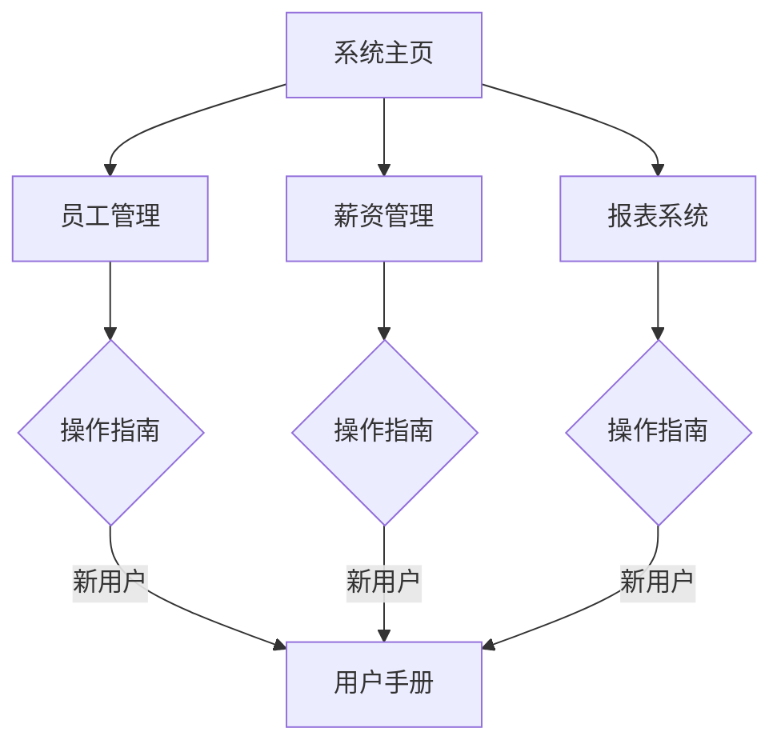

# 高新区工资信息管理系统 - 文档指南

## 核心文档索引

1. [系统功能介绍 - memory-bank/system_introduction.md](../memory-bank/system_introduction.md)
2. [用户操作手册 - memory-bank/user_guide.md](../memory-bank/user_guide.md)

## 模块详细说明
- **员工管理**
  - [员工档案管理规范](HRManagement/employees.md)
  - [请休假管理流程](HRManagement/leave_process.md)
  - [新员工入职指引](HRManagement/onboarding.md)

- **薪资管理**
  - [薪资计算公式说明](Payroll/calculation_formulas.md)
  - [特殊津贴规则](Payroll/allowances.md)
  - [社保公积金计算标准](Payroll/social_insurance.md)

- **报表系统**
  - [报表模板目录](Reports/templates.md)
  - [自定义报表创建指南](Reports/custom_reports.md)
  - [数据源配置手册](Reports/data_sources.md)

## 最新更新记录

| 版本 | 更新时间 | 主要更新内容 |
|------|----------|-------------|
| 2.1 | 2025-05-20 | 新增批量导入功能 优化报表生成速度 |
| 2.0 | 2025-04-15 | 重构薪资计算引擎 增加多种薪资模板 |
| 1.8 | 2025-03-10 | 员工自助服务门户上线 |

## 快速入口

## 技术支持
- **技术文档维护组**：xumingyang@example.com
- **更新频率**：每月第一周更新系统文档
- **文档反馈**：[提交反馈](https://docs.example.com/feedback)