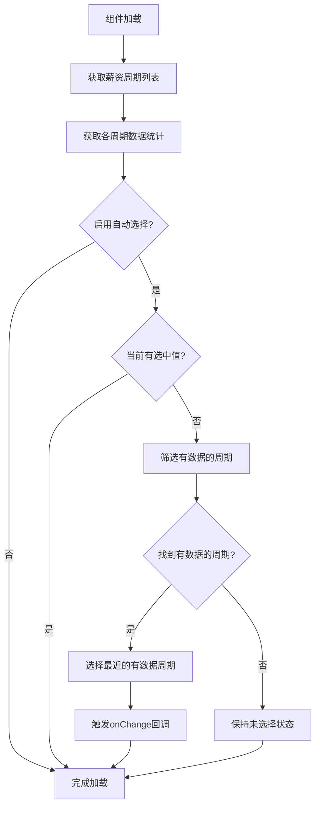

# 薪资周期选择器自动选择功能

## 🎯 功能概述

`PayrollPeriodSelector` 组件新增了自动选择最近一个有记录数据的薪资周期功能，解决了用户每次进入页面都需要手动选择周期的问题。

## 🚀 功能特性

### 自动选择逻辑
1. **优先级**：选择最近的（按日期倒序）有数据记录的薪资周期
2. **条件**：只有在当前没有选中任何周期时才会自动选择
3. **数据驱动**：基于实际的薪资记录数量进行选择，而不是简单选择最新周期

### 使用场景
- ✅ **薪资记录管理页面** - 自动加载最近有数据的周期
- ✅ **薪资报表页面** - 快速定位到有数据的周期
- ❌ **批量导入页面** - 需要用户明确选择目标周期
- ❌ **新建薪资周期** - 通常需要选择最新的周期

## 📝 使用方法

### 基本用法

```tsx
<PayrollPeriodSelector
  value={selectedPeriodId}
  onChange={handlePeriodChange}
  autoSelectLatestWithData={true}  // 🆕 启用自动选择
  showDataStats={true}             // 必须启用数据统计
  mode="card"
/>
```

### 完整示例

```tsx
const PayrollEntryPage: React.FC = () => {
  const [selectedPeriodId, setSelectedPeriodId] = useState<number | null>(null);

  const handlePeriodChange = (value: number | null) => {
    setSelectedPeriodId(value);
  };

  return (
    <PayrollPeriodSelector
      value={selectedPeriodId}
      onChange={handlePeriodChange}
      mode="card"
      showSelectedStatus={true}
      showDataStats={true}
      autoSelectLatestWithData={true}  // 🎯 自动选择有数据的周期
      style={{ maxWidth: 400, marginBottom: 16 }}
    />
  );
};
```

## ⚙️ 配置选项

### autoSelectLatestWithData
- **类型**: `boolean`
- **默认值**: `false`
- **说明**: 是否自动选择最近一个有数据的薪资周期

### 依赖配置
- `showDataStats` 必须设置为 `true`
- `onChange` 回调函数必须提供
- 当前 `value` 必须为 `null` 或 `undefined`

## 🔄 工作流程



## 📊 选择策略

### 优先级排序
1. **有数据的周期** - 薪资记录数 > 0
2. **按日期倒序** - 最近的周期优先
3. **状态过滤** - 遵循环境限制配置

### 示例场景

假设有以下薪资周期：

| 周期名称 | 开始日期 | 记录数 | 状态 |
|---------|---------|-------|------|
| 2024年1月 | 2024-01-01 | 0 | 活动 |
| 2023年12月 | 2023-12-01 | 150 | 已关闭 |
| 2023年11月 | 2023-11-01 | 148 | 已关闭 |
| 2023年10月 | 2023-10-01 | 0 | 已关闭 |

**自动选择结果**: `2023年12月` (最近的有数据周期)

## 🎯 最佳实践

### 适用场景
```tsx
// ✅ 数据查看页面 - 自动加载有数据的周期
<PayrollPeriodSelector autoSelectLatestWithData={true} />

// ✅ 报表页面 - 快速定位到有数据的周期  
<PayrollPeriodSelector autoSelectLatestWithData={true} />
```

### 不适用场景
```tsx
// ❌ 数据录入页面 - 用户需要明确选择
<PayrollPeriodSelector autoSelectLatestWithData={false} />

// ❌ 批量导入 - 需要用户确认目标周期
<PayrollPeriodSelector autoSelectLatestWithData={false} />
```

## 🐛 调试信息

启用自动选择后，控制台会输出以下调试信息：

```
✅ 薪资周期数据统计获取完成: {1: {count: 150, loading: false}, 2: {count: 0, loading: false}}
🎯 自动选择最近一个有数据的薪资周期: 2023年12月 (150人)
```

如果没有找到有数据的周期：
```
📝 没有找到有数据的薪资周期，保持未选择状态
```

## 🔧 故障排除

### 自动选择不工作
1. 检查 `showDataStats` 是否为 `true`
2. 确认 `onChange` 回调已提供
3. 验证当前 `value` 是否为空
4. 查看控制台调试信息

### 选择了错误的周期
1. 检查数据统计是否正确
2. 验证周期排序逻辑
3. 确认环境限制配置

## 📈 性能影响

- **额外请求**: 需要获取各周期的数据统计
- **计算开销**: 最小，仅涉及数组过滤和排序
- **用户体验**: 显著提升，减少手动操作步骤 