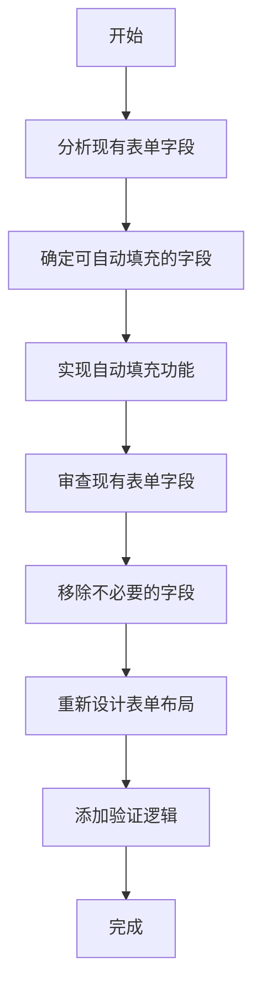

# 工资周期创建和编辑功能改进计划

## 1. 增加自动填充功能
### 目标
- 减少用户的重复输入。

### 步骤
1. 分析现有表单字段，确定哪些字段可以进行自动填充。
2. 使用前端框架（如React）中的状态管理工具（如Redux或Context API）来存储和管理自动填充的数据。
3. 在表单组件中实现自动填充逻辑，确保数据正确填充到相应的字段中。

## 2. 简化表单填写过程
### 目标
- 简化表单布局，减少冗余字段，使用户更容易填写。

### 步骤
1. 审查现有的表单字段，识别并移除不必要的字段。
2. 重新设计表单布局，使其更加直观和易于使用。
3. 添加必要的验证逻辑，确保用户输入的数据有效。

## 计划图示

## 详细步骤

1. **分析现有表单字段**
   - 读取现有的表单文件，例如 `frontend/v2/src/pages/Payroll/pages/PayrollPeriodsPage.tsx` 和 `frontend/v2/src/pages/Payroll/pages/PayrollEntryPage.tsx`。
   - 识别表单中的所有字段，并确定哪些字段可以进行自动填充。

2. **实现自动填充功能**
   - 使用状态管理工具（如Redux或Context API）来存储和管理自动填充的数据。
   - 在表单组件中实现自动填充逻辑，确保数据正确填充到相应的字段中。

3. **审查现有表单字段**
   - 重新审查表单字段，识别并移除不必要的字段。
   - 重新设计表单布局，使其更加直观和易于使用。

4. **添加验证逻辑**
   - 为表单字段添加必要的验证逻辑，确保用户输入的数据有效。