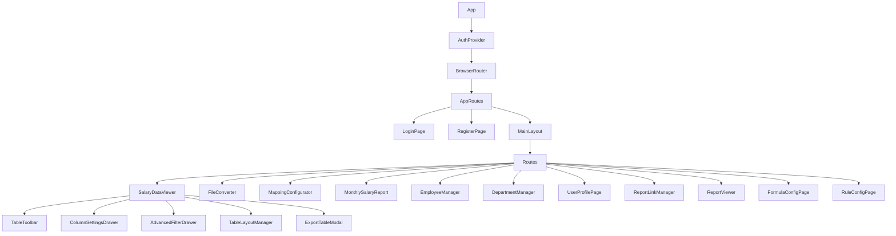
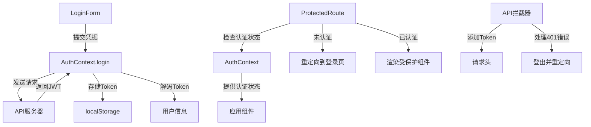
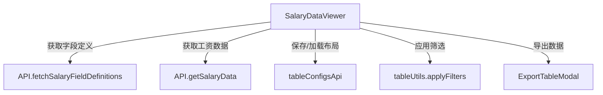
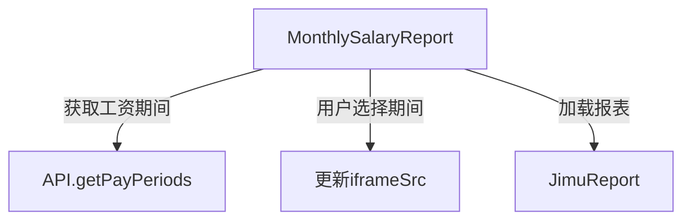

# 高新区工资信息管理系统 - 前端架构文档

## 1. 总体架构

### 1.1 技术栈

- **核心框架**: React 18+ (使用Vite构建)
- **UI组件库**: Ant Design
- **语言**: TypeScript
- **状态管理**: React Context API
- **路由**: React Router v6
- **国际化**: i18next
- **HTTP客户端**: Axios
- **报表集成**: JimuReport

### 1.2 项目结构

```
frontend/salary-viewer/src/
├── assets/            # 静态资源
├── components/        # 组件
│   ├── common/        # 通用组件
│   └── table/         # 表格相关组件
├── context/           # 上下文(Context)
├── hooks/             # 自定义钩子
├── locales/           # 国际化资源
│   ├── en/            # 英文翻译
│   └── zh/            # 中文翻译
├── pages/             # 页面组件
│   └── config/        # 配置页面
├── services/          # API服务
└── utils/             # 工具函数
```

## 2. 核心组件层级图



## 3. 认证流程

### 3.1 认证架构



### 3.2 认证组件

- **AuthContext**: 提供认证状态和方法的上下文
  - `isAuthenticated`: 用户是否已认证
  - `user`: 当前用户信息
  - `token`: JWT令牌
  - `login()`: 登录方法
  - `logout()`: 登出方法

- **useAuth**: 自定义钩子，用于访问AuthContext
- **ProtectedRoute**: 保护需要认证的路由
- **LoginForm**: 用户登录表单组件

### 3.3 JWT认证流程

1. 用户在LoginForm中输入凭据
2. 调用AuthContext.login方法
3. 发送POST请求到/token端点
4. 接收JWT令牌并存储在localStorage
5. 解码JWT获取用户信息
6. 更新认证状态
7. API拦截器自动为请求添加Authorization头
8. 401错误自动触发登出流程

## 4. 工资数据展示

### 4.1 SalaryDataViewer组件

SalaryDataViewer是系统的核心组件，负责展示和管理工资数据。

#### 主要功能:

- 动态表格列配置
- 基本筛选和高级筛选
- 表格布局保存和加载
- 数据导出(Excel/CSV)
- 本地分页

#### 数据流:



### 4.2 表格组件

- **TableToolbar**: 表格工具栏，提供列设置、高级筛选、布局管理和导出功能
- **ColumnSettingsDrawer**: 列设置抽屉，用于配置表格列的显示、隐藏、固定和宽度
- **AdvancedFilterDrawer**: 高级筛选抽屉，支持复杂的条件筛选
- **TableLayoutManager**: 表格布局管理器，用于保存、加载和管理表格布局
- **ExportTableModal**: 导出表格模态框，支持Excel和CSV格式

### 4.3 数据模型

- **SalaryRecord**: 工资记录数据模型，包含以下主要字段组:
  - 基本信息(employee_name, id_card_number等)
  - 年金相关字段(ann_*)
  - 住房公积金相关字段(hf_*)
  - 医疗保险相关字段(med_*)
  - 养老保险相关字段(pen_*)
  - 薪资相关字段(sal_*)
  - 税务相关字段(tax_*)
  - 计算总额(calc_*)

## 5. 报表系统

### 5.1 MonthlySalaryReport组件

MonthlySalaryReport组件负责展示月度工资报表，通过集成JimuReport实现。

#### 报表主要功能:

- 获取可用的工资期间
- 根据选择的期间加载对应报表
- 通过iframe嵌入JimuReport报表

#### 数据流:



### 5.2 ReportViewer组件

ReportViewer是一个通用的报表查看器，可以加载不同类型的报表。

### 5.3 ReportLinkManager组件

ReportLinkManager用于管理报表链接，支持添加、编辑和删除报表链接。

## 6. 状态管理机制

### 6.1 全局状态

- **AuthContext**: 管理用户认证状态
  - 提供用户信息、认证状态、登录和登出方法
  - 使用localStorage持久化JWT令牌

### 6.2 组件状态

- **useState**: 用于管理组件内部状态
- **useEffect**: 用于处理副作用，如数据获取、订阅和DOM操作
- **useCallback**: 用于优化性能，避免不必要的函数重新创建

### 6.3 状态持久化

- **localStorage**: 用于持久化用户认证状态和表格配置
- **服务器存储**: 表格布局和筛选方案可以保存到服务器

## 7. 国际化实现

### 7.1 i18next配置

- 使用i18next和react-i18next实现国际化
- 支持中文(zh)和英文(en)两种语言
- 使用LanguageDetector自动检测用户语言
- 默认语言为中文(zh)

### 7.2 翻译资源

- 翻译文件位于`src/locales/`目录
- 使用JSON格式存储翻译键值对
- 按功能模块组织翻译键

### 7.3 使用方式

- 通过`useTranslation`钩子获取`t`函数
- 使用`t('key')`方式获取翻译文本
- 支持参数替换，如`t('key', { param: value })`

## 8. API服务层

### 8.1 基础API客户端

- 使用Axios创建API客户端实例
- 配置基础URL和超时时间
- 实现请求拦截器添加JWT认证头
- 实现响应拦截器处理401错误

### 8.2 API服务模块

- **api.ts**: 基础API客户端和通用API方法
- **tableConfigsApi.ts**: 表格配置相关API
- **reportLinksApi.ts**: 报表链接相关API
- **calculationAdminService.ts**: 计算规则管理相关API

### 8.3 API调用规范

- 使用异步/等待(async/await)模式
- 统一错误处理和日志记录
- 返回类型定义明确
- 失败时提供合理的默认值或空数组

## 9. 路由结构

### 9.1 主要路由

- `/login`: 登录页面
- `/register`: 注册页面
- `/viewer`: 工资数据查看器
- `/data-import/converter`: 文件转换器
- `/config/mappings`: 字段映射配置
- `/config/formulas`: 公式管理
- `/config/rules`: 规则管理
- `/config/users`: 用户管理
- `/admin/employees`: 员工管理
- `/admin/departments`: 部门管理
- `/profile`: 用户个人资料
- `/report-links`: 报表链接管理
- `/reports/:reportId`: 报表查看器

### 9.2 路由保护

- 使用ProtectedRoute组件保护需要认证的路由
- 未认证用户自动重定向到登录页面

## 10. 性能优化

### 10.1 已实现的优化

- 使用React.memo减少不必要的重渲染
- 使用useCallback和useMemo缓存函数和计算结果
- 表格数据本地分页减少服务器请求
- 按需加载组件(如TableLayoutManager)

### 10.2 潜在优化点

- 实现虚拟滚动处理大量数据
- 使用React.lazy和Suspense实现代码分割
- 优化大型表格的渲染性能
- 实现数据缓存减少重复请求
