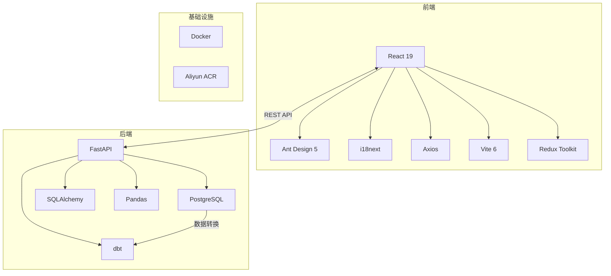
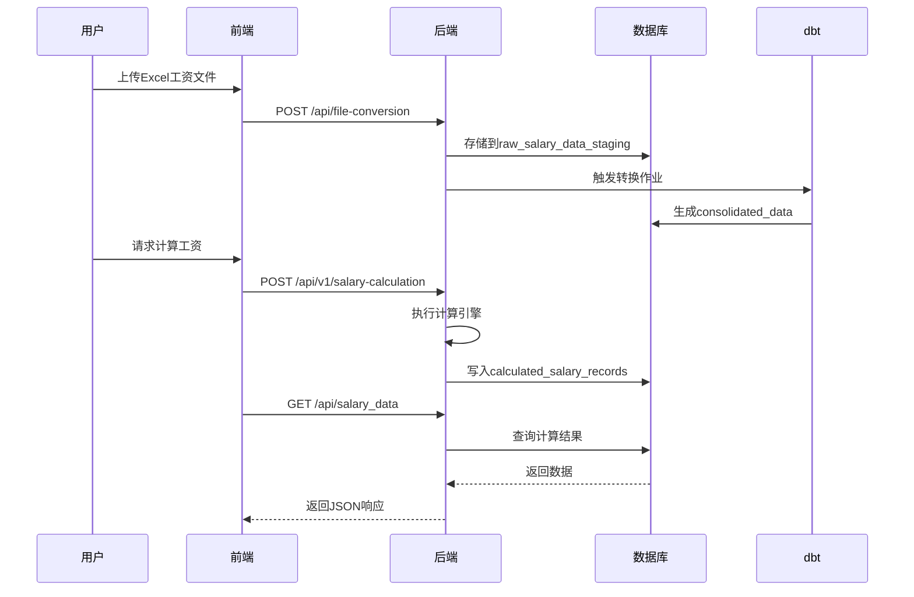

# 高新区工资信息管理系统 - 架构总览

## 1. 系统概述

- **业务目标**: 实现高新区机关事业单位工资信息的数字化管理
- **系统范围**: 工资数据导入、计算、查询、报表全流程
- **主要功能模块**:
  - 用户认证授权
  - 工资数据管理
  - 计算规则配置
  - 报表生成
  - 系统管理

## 2. 整体架构图

## 3. 技术栈

### 前端技术栈

- 框架: React 19 + TypeScript 5.7+
- 构建工具: Vite 6.3+
- UI组件库: Ant Design 5.24+
- 状态管理: Redux Toolkit + Context API
- 国际化: i18next
- HTTP客户端: Axios
- 拖拽功能: @dnd-kit
- 表格导出: xlsx

### 后端技术栈

- 框架: FastAPI
- 数据库: PostgreSQL 14+
- ORM: SQLAlchemy 2.0+
- 数据转换: dbt + Pandas
- 认证: JWT
- API文档: OpenAPI/Swagger

### 数据库设计

- 核心表: units, departments, employees, salary_records
- 特点: JSONB字段存储动态工资结构
- 视图: 正编人员工资视图等业务视图

## 4. 核心数据流

## 5. 关键接口规范

| 接口类别 | 认证方式 | 协议 | 示例端点 | 说明 |
|---------|---------|------|---------|------|
| 认证授权 | Basic Auth | HTTPS | /token | 获取JWT令牌 |
| 工资数据 | JWT | HTTPS | /api/salary_data | 分页查询支持 |
| 计算规则 | JWT+角色 | HTTPS | /api/v1/calculation-rules | 需要管理员权限 |
| 文件转换 | JWT | HTTPS | /api/file-conversion | 支持Excel/CSV |
| 表格配置 | JWT | HTTPS | /api/table-configs | 表格布局管理 |

## 6. 技术决策记录

### 6.1 前后端分离架构

- **决策原因**:
  - 前端团队熟悉React生态
  - 后端团队Python技术栈
  - 更好的职责分离和迭代效率
- **备选方案评估**:
  - Django全栈方案: 开发效率高但灵活性不足
  - Vue+Flask组合: 团队经验不足

### 6.2 JSONB字段设计

- **采用方案**: 使用PostgreSQL JSONB存储动态工资结构
- **优势**:
  - 灵活适应政策变化
  - 减少模式迁移次数
- **应对措施**:
  - 建立GIN索引优化查询
  - 应用层数据校验

### 6.3 规则引擎设计

- **核心机制**:
  - 优先级驱动的规则执行
  - 上下文感知的条件判断
  - 安全公式评估
- **扩展性**:
  - 规则配置化存储
  - 支持动态加载

## 7. 系统集成点

1. **报表系统集成**
   - 集成方式: iframe嵌入
   - 对接系统: JimuReport
   - 数据接口: /api/report-links

2. **未来扩展接口**
   - HR系统对接(员工主数据)
   - 财务系统对接(发放结果)
   - 短信通知服务

## 8. 部署架构

- **容器化方案**:
  - 前端容器: 基于nginx
  - 后端容器: 基于python:3.10
  - 数据库容器: postgres:14
- **云服务**:
  - 镜像仓库: 阿里云ACR
  - 部署平台: 阿里云ACK
- **环境配置**:
  - 开发环境: Docker Compose本地运行
  - 生产环境: Kubernetes集群部署
