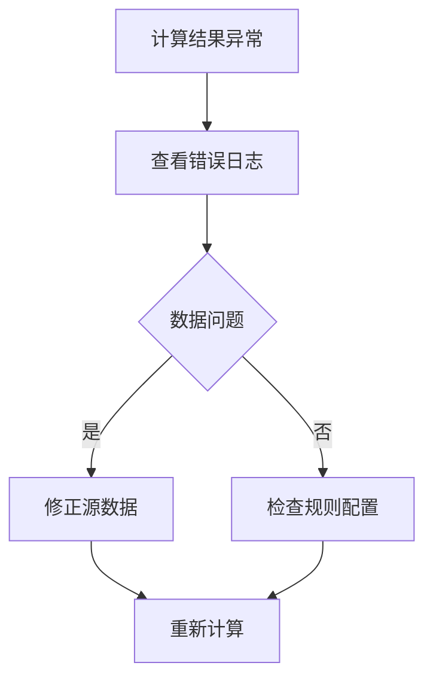

# 高新区工资信息管理系统 - 使用指南

## 系统登录与导航
1. **登录系统**：
   ```typescript
   // 示例登录流程
   await login(username, password); // 使用前端API登录
   ```
   - 用户名：工号或注册邮箱
   - 密码：首次登录使用默认密码（需修改）

2. **主界面功能区域**：
   
   - 左侧菜单：按模块分类（HR管理、薪资、报表等）
   - 顶部快捷栏：通知、个人设置、搜索
   - 工作区：当前模块内容展示

## 员工管理操作指南

### 添加新员工
1. 进入【员工管理】>【新建】
2. 填写基本信息（带*号为必填项）
   ```python
   # 后端接口示例
   POST /api/employees
   {
     "name": "张三",
     "department_id": 102,
     "position": "工程师",
     "salary_grade": "G7"
   }
   ```
3. 上传身份证及证件照
4. 保存并生成员工档案

### 批量导入员工数据
```bash
# 使用系统提供的导入脚本
python scripts/import_employees_parameterized.py --file new_employees.xlsx
```

## 薪资计算流程

### 月度薪资计算
1. 进入【薪资管理】>【计算周期】
2. 选择计算月份
3. 设置计算规则：
   ```python
   # 计算引擎配置示例
   calculation_engine.configure(
       base_salary_rules='config/base_rules.yaml',
       bonus_rules='config/bonus_rules.yaml'
   )
   ```
4. 点击【启动计算】查看实时日志
5. 结果预览后锁定

### 异常处理流程


## 报表管理系统

### 创建新报表
1. 选择【报表管理】>【新建报表】
2. 配置数据源：
   ```typescript
   // 前端API调用示例
   createDataSource({
     name: '部门薪资统计',
     type: 'postgresql',
     query: 'SELECT dept, AVG(salary) FROM employees GROUP BY dept'
   });
   ```
3. 设计展示字段
4. 设置筛选条件（部门、时间范围等）
5. 保存模板供后续使用

### 报表导出
- 支持格式：Excel、PDF、CSV
- 自动存入历史报表库

## 系统维护操作

### 密码重置
```bash
# 管理员命令行重置密码
python scripts/reset_password.py --user zhangsan --newpass 'NewPass123!'
```

### 数据库备份
```bash
# 每日自动备份脚本
bash scripts/db_backup.sh
```

## 联系方式
- **技术支持**：tech_support@example.com
- **紧急问题**：拨打 400-123-4567
- **反馈入口**：系统右下角「帮助」按钮